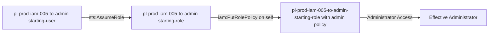

# Self-Escalation Privilege Escalation: iam:PutRolePolicy

* **Category:** Privilege Escalation
* **Sub-Category:** self-escalation
* **Path Type:** self-escalation
* **Target:** to-admin
* **Environments:** prod
* **Cost Estimate:** $0/mo
* **Technique:** Self-modification via iam:PutRolePolicy
* **Terraform Variable:** `enable_single_account_privesc_self_escalation_to_admin_iam_005_iam_putrolepolicy`
* **Schema Version:** 1.0.0
* **Pathfinding.cloud ID:** iam-005
* **Attack Path:** starting_user → (AssumeRole) → starting_role → (iam:PutRolePolicy on self) → admin access
* **Attack Principals:** `arn:aws:iam::{account_id}:user/pl-prod-iam-005-to-admin-starting-user`; `arn:aws:iam::{account_id}:role/pl-prod-iam-005-to-admin-starting-role`
* **Required Permissions:** `iam:PutRolePolicy` on `arn:aws:iam::*:role/pl-prod-iam-005-to-admin-starting-role`
* **Helpful Permissions:** `iam:GetRolePolicy` (View existing inline policies on the role); `iam:ListRolePolicies` (List all inline policies attached to the role)
* **MITRE Tactics:** TA0004 - Privilege Escalation, TA0003 - Persistence
* **MITRE Techniques:** T1098 - Account Manipulation, T1098.001 - Additional Cloud Credentials

## Attack Overview

This scenario demonstrates a privilege escalation vulnerability where a role can modify its own inline policies using `iam:PutRolePolicy`. The attacker starts with minimal permissions but can grant themselves administrator access by adding an inline policy to their own role.

### MITRE ATT&CK Mapping

- **Tactic**: Privilege Escalation
- **Technique**: T1078.004 - Valid Accounts: Cloud Accounts
- **Sub-technique**: Abuse of IAM Permissions

### Principals in the attack path

- `arn:aws:iam::PROD_ACCOUNT:user/pl-prod-iam-005-to-admin-starting-user`
- `arn:aws:iam::PROD_ACCOUNT:role/pl-prod-iam-005-to-admin-starting-role`

### Attack Path Diagram



### Attack Steps

1. **Initial Access**: `pl-prod-iam-005-to-admin-starting-user` assumes the role `pl-prod-iam-005-to-admin-starting-role` to begin the scenario
2. **Self-Modification**: `pl-prod-iam-005-to-admin-starting-role` uses `iam:PutRolePolicy` to add an inline policy granting administrator access to itself
3. **Verification**: Verify administrator access with the modified role

### Scenario specific resources created

| ARN | Purpose |
| -- | -- |
| `arn:aws:iam::PROD_ACCOUNT:user/pl-prod-iam-005-to-admin-starting-user` | Scenario-specific starting user with AssumeRole permission |
| `arn:aws:iam::PROD_ACCOUNT:role/pl-prod-iam-005-to-admin-starting-role` | Starting role with self-modification capability |
| `arn:aws:iam::PROD_ACCOUNT:policy/pl-prod-iam-005-to-admin-policy` | Allows `iam:PutRolePolicy` on the role itself |

## Attack Lab

### Prerequisites

1. Install the `plabs` CLI:
   ```bash
   brew install pathfinding-labs/tap/plabs
   ```
2. Configure your AWS profiles in `~/.plabs/plabs.yaml` (or run `plabs init` if you haven't already)

### Deploy with plabs non-interactive

```bash
plabs enable enable_single_account_privesc_self_escalation_to_admin_iam_005_iam_putrolepolicy
plabs apply
```

### Deploy with plabs tui

1. Launch the TUI: `plabs`
2. Navigate to this scenario in the scenarios list
3. Press `space` to enable it
4. Press `d` to deploy

### Executing the automated demo_attack script

The script will:
1. Display a step-by-step walkthrough with color-coded output
2. Show the commands being executed and their results
3. Verify successful privilege escalation
4. Output standardized test results for automation

#### Resources created by attack script

- Inline policy added to `pl-prod-iam-005-to-admin-starting-role` granting administrator access

#### With plabs non-interactive

```bash
plabs demo --list
plabs demo iam-005-iam-putrolepolicy
```

#### With plabs tui

1. Launch the TUI: `plabs`
2. Navigate to this scenario in the scenarios list
3. Press `r` to run the demo script

### Cleanup

#### With plabs non-interactive

```bash
plabs cleanup --list
plabs cleanup iam-005-iam-putrolepolicy
```

#### With plabs tui

1. Launch the TUI: `plabs`
2. Navigate to this scenario in the scenarios list
3. Press `c` to run the cleanup script

### Teardown with plabs non-interactive

```bash
plabs disable enable_single_account_privesc_self_escalation_to_admin_iam_005_iam_putrolepolicy
plabs apply
```

### Teardown with plabs tui

1. Launch the TUI: `plabs`
2. Navigate to this scenario in the scenarios list
3. Press `space` to disable it
4. Press `D` to destroy

## Detecting Misconfiguration (CSPM)

### What CSPM tools should detect

- IAM role `pl-prod-iam-005-to-admin-starting-role` has `iam:PutRolePolicy` on itself, enabling self-escalation to administrator
- Privilege escalation path detected: role can modify its own inline policies to gain admin access
- IAM principal with permissions to modify its own trust or permission boundary

### Prevention recommendations

- Avoid granting `iam:PutRolePolicy` permissions on roles
- If required, use resource-based conditions to restrict which roles can be modified
- Implement SCPs to prevent self-modification of roles
- Monitor CloudTrail for `PutRolePolicy` API calls, especially when the role modifies itself
- Enable MFA requirements for sensitive operations
- Use IAM Access Analyzer to identify privilege escalation paths

## Detection Abuse (CloudSIEM)

### CloudTrail events to monitor

- `IAM: PutRolePolicy` — Inline policy added to a role; critical when the caller and the target role are the same principal (self-modification)
- `STS: AssumeRole` — Role assumption event; monitor for the starting user assuming the escalation role

### Detonation logs

_Detonation log integration (Stratus Red Team / Grimoire) is planned for a future release._

