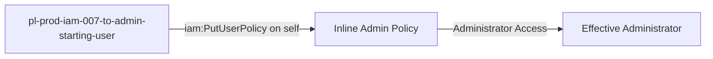

# Self-Escalation Privilege Escalation: iam:PutUserPolicy

* **Category:** Privilege Escalation
* **Sub-Category:** self-escalation
* **Path Type:** self-escalation
* **Target:** to-admin
* **Environments:** prod
* **Cost Estimate:** $0/mo
* **Pathfinding.cloud ID:** iam-007
* **Technique:** Self-modification via iam:PutUserPolicy to attach inline admin policy
* **Terraform Variable:** `enable_single_account_privesc_self_escalation_to_admin_iam_007_iam_putuserpolicy`
* **Schema Version:** 1.0.0
* **Attack Path:** starting_user → (iam:PutUserPolicy on self) → inline admin policy → admin access
* **Attack Principals:** `arn:aws:iam::{account_id}:user/pl-prod-iam-007-to-admin-starting-user`
* **Required Permissions:** `iam:PutUserPolicy` on `*`
* **Helpful Permissions:** `iam:GetUser` (View user details and verify policy attachment); `iam:ListUserPolicies` (List existing inline policies on users)
* **MITRE Tactics:** TA0004 - Privilege Escalation, TA0003 - Persistence
* **MITRE Techniques:** T1098 - Account Manipulation, T1098.001 - Additional Cloud Credentials

## Attack Overview

This scenario demonstrates a privilege escalation vulnerability where a principal has permission to put inline policies on IAM users, including themselves. The attacker can use `iam:PutUserPolicy` to attach an inline policy granting administrator access to their own user, immediately escalating their privileges.

### MITRE ATT&CK Mapping

- **Tactic**: Privilege Escalation, Persistence
- **Technique**: T1098 - Account Manipulation
- **Sub-technique**: T1098.001 - Additional Cloud Credentials
- **Additional**: T1078.004 - Cloud Accounts

### Principals in the attack path

- `arn:aws:iam::PROD_ACCOUNT:user/pl-prod-iam-007-to-admin-starting-user` (starting user)

### Attack Path Diagram



### Attack Steps

1. **Initial Access**: Use the access keys for `pl-prod-iam-007-to-admin-starting-user`
2. **Attach Inline Policy**: Use `iam:PutUserPolicy` to attach an inline policy granting AdministratorAccess to the current user
3. **Immediate Escalation**: The inline policy takes effect immediately, granting admin access
4. **Verification**: Verify administrator access with the escalated permissions

### Scenario specific resources created

| ARN | Purpose |
| -- | -- |
| `arn:aws:iam::PROD_ACCOUNT:user/pl-prod-iam-007-to-admin-starting-user` | User with PutUserPolicy permission on itself |

## Attack Lab

### Prerequisites

1. Install the `plabs` CLI:
   ```bash
   brew install pathfinding-labs/tap/plabs
   ```
2. Configure your AWS profiles in `~/.plabs/plabs.yaml` (or run `plabs init` if you haven't already)

### Deploy with plabs non-interactive

```bash
plabs enable enable_single_account_privesc_self_escalation_to_admin_iam_007_iam_putuserpolicy
plabs apply
```

### Deploy with plabs tui

1. Launch the TUI: `plabs`
2. Navigate to this scenario in the scenarios list
3. Press `space` to enable it
4. Press `d` to deploy

### Executing the automated demo_attack script

The script will:
1. Display a step-by-step walkthrough with color-coded output
2. Show the commands being executed and their results
3. Verify successful privilege escalation
4. Output standardized test results for automation

#### Resources created by attack script

- Inline IAM policy attached to `pl-prod-iam-007-to-admin-starting-user` granting AdministratorAccess

#### With plabs non-interactive

```bash
plabs demo --list
plabs demo iam-007-iam-putuserpolicy
```

#### With plabs tui

1. Launch the TUI: `plabs`
2. Navigate to this scenario in the scenarios list
3. Press `r` to run the demo script

### Cleanup

#### With plabs non-interactive

```bash
plabs cleanup --list
plabs cleanup iam-007-iam-putuserpolicy
```

#### With plabs tui

1. Launch the TUI: `plabs`
2. Navigate to this scenario in the scenarios list
3. Press `c` to run the cleanup script

### Teardown with plabs non-interactive

```bash
plabs disable enable_single_account_privesc_self_escalation_to_admin_iam_007_iam_putuserpolicy
plabs apply
```

### Teardown with plabs tui

1. Launch the TUI: `plabs`
2. Navigate to this scenario in the scenarios list
3. Press `space` to disable it
4. Press `D` to destroy

## Detecting Misconfiguration (CSPM)

### What CSPM tools should detect

- IAM user has `iam:PutUserPolicy` permission scoped to `*`, allowing self-modification
- Privilege escalation path exists: user can attach an inline admin policy to themselves
- No resource constraint prevents the user from modifying their own policies

### Prevention recommendations

- Never grant `iam:PutUserPolicy` permissions without strict resource constraints
- Use SCPs to prevent inline policy attachments on privileged users
- Implement least privilege - users should not be able to modify their own permissions
- Monitor CloudTrail for `PutUserPolicy` API calls, especially self-modifications
- Use IAM Access Analyzer to identify privilege escalation paths
- Prefer managed policies over inline policies for better visibility and control
- Enable MFA requirements for sensitive IAM operations

## Detection Abuse (CloudSIEM)

### CloudTrail events to monitor

- `IAM: PutUserPolicy` — Inline policy added to an IAM user; critical when the target is the calling principal (self-escalation)

### Detonation logs

_Detonation log integration (Stratus Red Team / Grimoire) is planned for a future release._