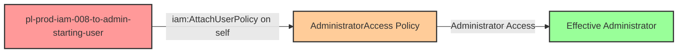

# Self-Escalation Privilege Escalation: iam:AttachUserPolicy

* **Category:** Privilege Escalation
* **Sub-Category:** self-escalation
* **Path Type:** self-escalation
* **Target:** to-admin
* **Environments:** prod
* **Cost Estimate:** $0/mo
* **Pathfinding.cloud ID:** iam-008
* **Technique:** User self-modification via iam:AttachUserPolicy to attach managed admin policy
* **Terraform Variable:** `enable_single_account_privesc_self_escalation_to_admin_iam_008_iam_attachuserpolicy`
* **Schema Version:** 1.0.0
* **Attack Path:** starting_user → (iam:AttachUserPolicy on self) → attach AdministratorAccess → admin access
* **Attack Principals:** `arn:aws:iam::{account_id}:user/pl-prod-iam-008-to-admin-starting-user`
* **Required Permissions:** `iam:AttachUserPolicy` on `*`
* **Helpful Permissions:** `iam:ListAttachedUserPolicies` (List managed policies attached to user); `iam:ListPolicies` (Discover available managed policies to attach)
* **MITRE Tactics:** TA0004 - Privilege Escalation, TA0003 - Persistence
* **MITRE Techniques:** T1098 - Account Manipulation, T1098.001 - Additional Cloud Credentials

## Attack Overview

This scenario demonstrates a privilege escalation vulnerability where a user has permission to attach managed policies to themselves. The attacker can use `iam:AttachUserPolicy` to attach the AWS-managed `AdministratorAccess` policy to their own user, immediately escalating their privileges to administrator level.

Unlike inline policies, this technique leverages existing managed policies, making it simpler to execute and potentially easier to overlook during security reviews. The attack requires only a single API call to gain full administrative access.

### MITRE ATT&CK Mapping

- **Tactic**: Privilege Escalation (TA0004), Persistence (TA0003)
- **Technique**: T1098 - Account Manipulation
- **Sub-technique**: T1098.001 - Additional Cloud Credentials
- **Additional**: T1078.004 - Valid Accounts: Cloud Accounts

### Principals in the attack path

- `arn:aws:iam::PROD_ACCOUNT:user/pl-prod-iam-008-to-admin-starting-user`

### Attack Path Diagram



### Attack Steps

1. **Scaffolding aka Initial Access**: Either:
   - `pl-pathfinding-starting-user-prod` assumes the role `pl-iam-008-adam` to begin the scenario, OR
   - Use the access keys for `pl-iam-008-user` directly
2. **Attach Managed Policy**: Use `iam:AttachUserPolicy` to attach the `arn:aws:iam::aws:policy/AdministratorAccess` managed policy to the current user
3. **Immediate Escalation**: The managed policy takes effect immediately, granting full administrative access
4. **Verification**: Verify administrator access with the escalated permissions

### Scenario specific resources created

| ARN | Purpose |
| -- | -- |
| `arn:aws:iam::PROD_ACCOUNT:role/pl-iam-008-adam` | Role with AttachUserPolicy permission |
| `arn:aws:iam::PROD_ACCOUNT:user/pl-iam-008-user` | User with AttachUserPolicy permission |
| `arn:aws:iam::PROD_ACCOUNT:policy/pl-prod-one-hop-attachuserpolicy-policy` | Policy allowing `iam:AttachUserPolicy` on any resource |

## Attack Lab

### Prerequisites

1. Install the `plabs` CLI:
   ```bash
   brew install pathfinding-labs/tap/plabs
   ```
2. Configure your AWS profiles in `~/.plabs/plabs.yaml` (or run `plabs init` if you haven't already)

### Deploy with plabs non-interactive

```bash
plabs enable enable_single_account_privesc_self_escalation_to_admin_iam_008_iam_attachuserpolicy
plabs apply
```

### Deploy with plabs tui

1. Launch the TUI: `plabs`
2. Navigate to this scenario in the scenarios list
3. Press `space` to enable it
4. Press `d` to deploy

### Executing the automated demo_attack script

The script will:
1. Display a step-by-step walkthrough with color-coded output
2. Show the commands being executed and their results
3. Verify successful privilege escalation
4. Output standardized test results for automation

#### Resources created by attack script

- Managed policy attachment: `arn:aws:iam::aws:policy/AdministratorAccess` attached to the starting user

#### With plabs non-interactive

```bash
plabs demo --list
plabs demo iam-008-iam-attachuserpolicy
```

#### With plabs tui

1. Launch the TUI: `plabs`
2. Navigate to this scenario in the scenarios list
3. Press `r` to run the demo script

### Cleanup

#### With plabs non-interactive

```bash
plabs cleanup --list
plabs cleanup iam-008-iam-attachuserpolicy
```

#### With plabs tui

1. Launch the TUI: `plabs`
2. Navigate to this scenario in the scenarios list
3. Press `c` to run the cleanup script

### Teardown with plabs non-interactive

```bash
plabs disable enable_single_account_privesc_self_escalation_to_admin_iam_008_iam_attachuserpolicy
plabs apply
```

### Teardown with plabs tui

1. Launch the TUI: `plabs`
2. Navigate to this scenario in the scenarios list
3. Press `space` to disable it
4. Press `D` to destroy

## Detecting Misconfiguration (CSPM)

### What CSPM tools should detect

- IAM user has `iam:AttachUserPolicy` permission on `*`, enabling self-attachment of any managed policy
- Privilege escalation path detected: user can attach `AdministratorAccess` to themselves
- No resource constraint on `iam:AttachUserPolicy` — no `iam:PolicyARN` condition key limiting attachable policies

### Prevention recommendations

- Never grant `iam:AttachUserPolicy` permissions without strict resource constraints
- Use SCPs to prevent managed policy attachments on privileged users
- Implement least privilege — users should not be able to modify their own permissions
- Restrict which managed policies can be attached using `iam:PolicyARN` condition keys
- Use IAM Access Analyzer to identify privilege escalation paths
- Enable MFA requirements for sensitive IAM operations
- Set up alerts for attachment of high-privilege managed policies like AdministratorAccess

## Detection Abuse (CloudSIEM)

### CloudTrail events to monitor

- `IAM: AttachUserPolicy` — Managed policy attached to an IAM user; critical when the target user is the caller (self-attachment) or when the attached policy is `AdministratorAccess`

### Detonation logs

_Detonation log integration (Stratus Red Team / Grimoire) is planned for a future release._
