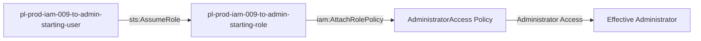

# Self-Escalation Privilege Escalation: iam:AttachRolePolicy

* **Category:** Privilege Escalation
* **Sub-Category:** self-escalation
* **Path Type:** self-escalation
* **Target:** to-admin
* **Environments:** prod
* **Cost Estimate:** $0/mo
* **Pathfinding.cloud ID:** iam-009
* **Technique:** Self-modification via iam:AttachRolePolicy
* **Terraform Variable:** `enable_single_account_privesc_self_escalation_to_admin_iam_009_iam_attachrolepolicy`
* **Schema Version:** 1.0.0
* **Attack Path:** starting_user → (AssumeRole) → starting_role → (iam:AttachRolePolicy on self) → attach AdministratorAccess → admin access
* **Attack Principals:** `arn:aws:iam::{account_id}:user/pl-prod-iam-009-to-admin-starting-user`; `arn:aws:iam::{account_id}:role/pl-prod-iam-009-to-admin-starting-role`
* **Required Permissions:** `iam:AttachRolePolicy` on `arn:aws:iam::*:role/pl-prod-iam-009-to-admin-starting-role`
* **Helpful Permissions:** `iam:ListAttachedRolePolicies` (List managed policies attached to the role); `iam:ListPolicies` (Discover available managed policies to attach)
* **MITRE Tactics:** TA0004 - Privilege Escalation, TA0003 - Persistence
* **MITRE Techniques:** T1098 - Account Manipulation, T1098.001 - Additional Cloud Credentials

## Attack Overview

This scenario demonstrates a privilege escalation vulnerability where a role can attach managed policies to itself using `iam:AttachRolePolicy`. The attacker starts with minimal permissions but can grant themselves administrator access by attaching the AWS-managed AdministratorAccess policy to their own role.

### MITRE ATT&CK Mapping

- **Tactic**: Privilege Escalation
- **Technique**: T1078.004 - Valid Accounts: Cloud Accounts
- **Sub-technique**: Abuse of IAM Permissions

### Principals in the attack path

- `arn:aws:iam::PROD_ACCOUNT:user/pl-prod-iam-009-to-admin-starting-user`
- `arn:aws:iam::PROD_ACCOUNT:role/pl-prod-iam-009-to-admin-starting-role`

### Attack Path Diagram



### Attack Steps

1. **Initial Access**: `pl-prod-iam-009-to-admin-starting-user` assumes the role `pl-prod-iam-009-to-admin-starting-role` to begin the scenario
2. **Attach Admin Policy**: `pl-prod-iam-009-to-admin-starting-role` uses `iam:AttachRolePolicy` to attach the AWS-managed AdministratorAccess policy to itself
3. **Verification**: Verify administrator access with the modified role

### Scenario specific resources created

| ARN | Purpose |
| -- | -- |
| `arn:aws:iam::PROD_ACCOUNT:user/pl-prod-iam-009-to-admin-starting-user` | Scenario-specific starting user with AssumeRole permission |
| `arn:aws:iam::PROD_ACCOUNT:role/pl-prod-iam-009-to-admin-starting-role` | Starting role with policy attachment capability |
| `arn:aws:iam::PROD_ACCOUNT:policy/pl-prod-iam-009-to-admin-policy` | Allows `iam:AttachRolePolicy` on the role itself |

## Attack Lab

### Prerequisites

1. Install the `plabs` CLI:
   ```bash
   brew install pathfinding-labs/tap/plabs
   ```
2. Configure your AWS profiles in `~/.plabs/plabs.yaml` (or run `plabs init` if you haven't already)

### Deploy with plabs non-interactive

```bash
plabs enable enable_single_account_privesc_self_escalation_to_admin_iam_009_iam_attachrolepolicy
plabs apply
```

### Deploy with plabs tui

1. Launch the TUI: `plabs`
2. Navigate to this scenario in the scenarios list
3. Press `space` to enable it
4. Press `d` to deploy

### Executing the automated demo_attack script

The script will:
1. Display a step-by-step walkthrough with color-coded output
2. Show the commands being executed and their results
3. Verify successful privilege escalation
4. Output standardized test results for automation

#### Resources created by attack script

- AdministratorAccess managed policy attached to `pl-prod-iam-009-to-admin-starting-role`

#### With plabs non-interactive

```bash
plabs demo --list
plabs demo iam-009-iam-attachrolepolicy
```

#### With plabs tui

1. Launch the TUI: `plabs`
2. Navigate to this scenario in the scenarios list
3. Press `r` to run the demo script

### Cleanup

#### With plabs non-interactive

```bash
plabs cleanup --list
plabs cleanup iam-009-iam-attachrolepolicy
```

#### With plabs tui

1. Launch the TUI: `plabs`
2. Navigate to this scenario in the scenarios list
3. Press `c` to run the cleanup script

### Teardown with plabs non-interactive

```bash
plabs disable enable_single_account_privesc_self_escalation_to_admin_iam_009_iam_attachrolepolicy
plabs apply
```

### Teardown with plabs tui

1. Launch the TUI: `plabs`
2. Navigate to this scenario in the scenarios list
3. Press `space` to disable it
4. Press `D` to destroy

## Detecting Misconfiguration (CSPM)

### What CSPM tools should detect

- IAM role `pl-prod-iam-009-to-admin-starting-role` has `iam:AttachRolePolicy` permission scoped to itself, enabling self-escalation
- Role can attach the AWS-managed `AdministratorAccess` policy to itself without any additional approval
- No SCP or permission boundary prevents the role from attaching high-privilege managed policies

### Prevention recommendations

- Avoid granting `iam:AttachRolePolicy` permissions on roles
- If required, use resource-based conditions to restrict which roles can be modified
- Implement SCPs to prevent self-attachment of policies
- Monitor CloudTrail for `AttachRolePolicy` API calls, especially when roles modify themselves
- Enable MFA requirements for sensitive operations
- Use IAM Access Analyzer to identify privilege escalation paths
- Restrict attachment of high-privilege AWS-managed policies like AdministratorAccess
- Use conditions to limit which policies can be attached (e.g., by policy name pattern)

## Detection Abuse (CloudSIEM)

### CloudTrail events to monitor

- `IAM: AttachRolePolicy` — Managed policy attached to a role; critical when the role is the same principal making the call (self-escalation)
- `STS: AssumeRole` — Role assumption by the starting user to obtain the escalation-capable role credentials

### Detonation logs

_Detonation log integration (Stratus Red Team / Grimoire) is planned for a future release._
