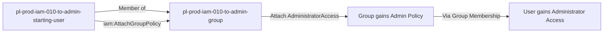

# Self-Escalation Privilege Escalation: iam:AttachGroupPolicy

* **Category:** Privilege Escalation
* **Sub-Category:** self-escalation
* **Path Type:** self-escalation
* **Target:** to-admin
* **Environments:** prod
* **Cost Estimate:** $0/mo
* **Pathfinding.cloud ID:** iam-010
* **Technique:** Self-escalation via attaching admin policy to own group
* **Terraform Variable:** `enable_single_account_privesc_self_escalation_to_admin_iam_010_iam_attachgrouppolicy`
* **Schema Version:** 1.0.0
* **Attack Path:** starting_user → (iam:AttachGroupPolicy) → attach admin policy to own group → admin access
* **Attack Principals:** `arn:aws:iam::{account_id}:user/pl-prod-iam-010-to-admin-starting-user`; `arn:aws:iam::{account_id}:group/pl-prod-iam-010-to-admin-group`
* **Required Permissions:** `iam:AttachGroupPolicy` on `*`
* **Helpful Permissions:** `iam:ListGroups` (List groups the user belongs to); `iam:ListAttachedGroupPolicies` (View currently attached group policies); `iam:ListPolicies` (Discover available managed policies)
* **MITRE Tactics:** TA0004 - Privilege Escalation, TA0003 - Persistence
* **MITRE Techniques:** T1098 - Account Manipulation, T1098.001 - Additional Cloud Credentials

## Attack Overview

This scenario demonstrates a privilege escalation vulnerability where an IAM user has permission to attach managed policies to a group they are a member of. The attacker can use `iam:AttachGroupPolicy` to attach the `AdministratorAccess` managed policy to their own group, thereby gaining administrator access through group membership.

### MITRE ATT&CK Mapping

- **Tactic**: Privilege Escalation
- **Technique**: T1098.003 - Account Manipulation: Additional Cloud Roles
- **Sub-technique**: Modifying group policies to gain elevated privileges

### Principals in the attack path

- `arn:aws:iam::PROD_ACCOUNT:user/pl-prod-iam-010-to-admin-starting-user` (Scenario-specific starting user)
- `arn:aws:iam::PROD_ACCOUNT:group/pl-prod-iam-010-to-admin-group` (IAM group that the user is a member of)

### Attack Path Diagram



### Attack Steps

1. **Initial Access**: Start as `pl-prod-iam-010-to-admin-starting-user` (credentials provided via Terraform outputs)
2. **Identify Group**: User is a member of `pl-prod-iam-010-to-admin-group`
3. **Attach Admin Policy**: Use `iam:AttachGroupPolicy` to attach `arn:aws:iam::aws:policy/AdministratorAccess` to the group
4. **Verification**: Verify administrator access via group membership

### Scenario specific resources created

| ARN | Purpose |
| -- | -- |
| `arn:aws:iam::PROD_ACCOUNT:user/pl-prod-iam-010-to-admin-starting-user` | Scenario-specific starting user with access keys |
| `arn:aws:iam::PROD_ACCOUNT:group/pl-prod-iam-010-to-admin-group` | IAM group that the user belongs to |
| `arn:aws:iam::PROD_ACCOUNT:policy/pl-prod-iam-010-to-admin-attachgrouppolicy-policy` | Allows `iam:AttachGroupPolicy` on the group |

## Attack Lab

### Prerequisites

1. Install the `plabs` CLI:
   ```bash
   brew install pathfinding-labs/tap/plabs
   ```
2. Configure your AWS profiles in `~/.plabs/plabs.yaml` (or run `plabs init` if you haven't already)

### Deploy with plabs non-interactive

```bash
plabs enable enable_single_account_privesc_self_escalation_to_admin_iam_010_iam_attachgrouppolicy
plabs apply
```

### Deploy with plabs tui

1. Launch the TUI: `plabs`
2. Navigate to this scenario in the scenarios list
3. Press `space` to enable it
4. Press `d` to deploy

### Executing the automated demo_attack script

The script will:
1. Display a step-by-step walkthrough with color-coded output
2. Show the commands being executed and their results
3. Verify successful privilege escalation
4. Output standardized test results for automation

#### Resources created by attack script

- `AdministratorAccess` managed policy attached to `pl-prod-iam-010-to-admin-group`

#### With plabs non-interactive

```bash
plabs demo --list
plabs demo iam-010-iam-attachgrouppolicy
```

#### With plabs tui

1. Launch the TUI: `plabs`
2. Navigate to this scenario in the scenarios list
3. Press `r` to run the demo script

### Cleanup

#### With plabs non-interactive

```bash
plabs cleanup --list
plabs cleanup iam-010-iam-attachgrouppolicy
```

#### With plabs tui

1. Launch the TUI: `plabs`
2. Navigate to this scenario in the scenarios list
3. Press `c` to run the cleanup script

### Teardown with plabs non-interactive

```bash
plabs disable enable_single_account_privesc_self_escalation_to_admin_iam_010_iam_attachgrouppolicy
plabs apply
```

### Teardown with plabs tui

1. Launch the TUI: `plabs`
2. Navigate to this scenario in the scenarios list
3. Press `space` to disable it
4. Press `D` to destroy

## Detecting Misconfiguration (CSPM)

### What CSPM tools should detect

- IAM user has `iam:AttachGroupPolicy` permission on a group they are a member of
- Privilege escalation path detected: user can elevate their own permissions via group policy attachment
- Group membership combined with group policy modification permission creates a self-escalation risk

### Prevention recommendations

- Avoid granting `iam:AttachGroupPolicy` permissions to users who are members of the target group
- Use resource-based conditions to restrict which groups can have policies attached
- Implement SCPs to prevent policy attachment to sensitive groups
- Monitor CloudTrail for `AttachGroupPolicy` API calls, especially for administrative policies
- Enable MFA requirements for sensitive IAM operations
- Use IAM Access Analyzer to identify privilege escalation paths
- Implement a least-privilege model where users cannot modify their own effective permissions

## Detection Abuse (CloudSIEM)

### CloudTrail events to monitor

- `IAM: AttachGroupPolicy` — Managed policy attached to an IAM group; critical when the policy is `AdministratorAccess` or otherwise grants elevated permissions

### Detonation logs

_Detonation log integration (Stratus Red Team / Grimoire) is planned for a future release._
