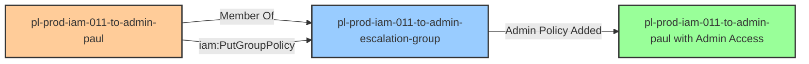

# Self-Escalation Privilege Escalation: iam:PutGroupPolicy

* **Category:** Privilege Escalation
* **Sub-Category:** self-escalation
* **Path Type:** self-escalation
* **Target:** to-admin
* **Environments:** prod
* **Cost Estimate:** $0/mo
* **Pathfinding.cloud ID:** iam-011
* **Technique:** Self-escalation via inline policy addition to own group
* **Terraform Variable:** `enable_single_account_privesc_self_escalation_to_admin_iam_011_iam_putgrouppolicy`
* **Schema Version:** 1.0.0
* **Attack Path:** starting_user → (iam:PutGroupPolicy) → add inline admin policy to own group → admin access
* **Attack Principals:** `arn:aws:iam::{account_id}:user/pl-prod-iam-011-to-admin-paul`; `arn:aws:iam::{account_id}:group/pl-prod-iam-011-to-admin-escalation-group`
* **Required Permissions:** `iam:PutGroupPolicy` on `*`
* **Helpful Permissions:** `iam:ListGroups` (List groups the user belongs to); `iam:GetGroupPolicy` (View existing inline group policies); `iam:ListGroupPolicies` (List all inline policies on group)
* **MITRE Tactics:** TA0004 - Privilege Escalation, TA0003 - Persistence
* **MITRE Techniques:** T1098 - Account Manipulation, T1098.001 - Additional Cloud Credentials

## Attack Overview

This scenario demonstrates a self-escalation vulnerability where a user has permission to put inline policies on a group they belong to. The user `pl-prod-iam-011-to-admin-paul` is a member of `pl-prod-iam-011-to-admin-escalation-group` and has `iam:PutGroupPolicy` permission on that same group. By adding an administrator inline policy to their own group, the user can escalate themselves to administrator access.

### MITRE ATT&CK Mapping

- **Tactic**: Privilege Escalation (TA0004)
- **Technique**: T1098.003 - Account Manipulation: Additional Cloud Roles
- **Sub-technique**: Modifying group policies to escalate privileges

### Principals in the attack path

- `arn:aws:iam::PROD_ACCOUNT:user/pl-prod-iam-011-to-admin-paul` (vulnerable user who performs self-escalation)
- `arn:aws:iam::PROD_ACCOUNT:group/pl-prod-iam-011-to-admin-escalation-group` (target group that pl-prod-iam-011-to-admin-paul belongs to)

### Attack Path Diagram



### Attack Steps

1. **Starting Point**: Authenticate as `pl-prod-iam-011-to-admin-paul` using their access keys
2. **Verify Membership**: Confirm `pl-prod-iam-011-to-admin-paul` is a member of `pl-prod-iam-011-to-admin-escalation-group`
3. **Self-Escalation**: Use `iam:PutGroupPolicy` to add an admin inline policy to their own group
4. **Admin Access**: `pl-prod-iam-011-to-admin-paul` now has administrator access through their group membership

### Scenario specific resources created

| ARN | Purpose |
| -- | -- |
| `arn:aws:iam::PROD_ACCOUNT:user/pl-prod-iam-011-to-admin-paul` | Vulnerable user with PutGroupPolicy permission on their own group |
| `arn:aws:iam::PROD_ACCOUNT:group/pl-prod-iam-011-to-admin-escalation-group` | Target group that pl-prod-iam-011-to-admin-paul belongs to |

## Attack Lab

### Prerequisites

1. Install the `plabs` CLI:
   ```bash
   brew install pathfinding-labs/tap/plabs
   ```
2. Configure your AWS profiles in `~/.plabs/plabs.yaml` (or run `plabs init` if you haven't already)

### Deploy with plabs non-interactive

```bash
plabs enable enable_single_account_privesc_self_escalation_to_admin_iam_011_iam_putgrouppolicy
plabs apply
```

### Deploy with plabs tui

1. Launch the TUI: `plabs`
2. Navigate to this scenario in the scenarios list
3. Press `space` to enable it
4. Press `d` to deploy

### Executing the automated demo_attack script

The script will:
1. Display a step-by-step walkthrough with color-coded output
2. Show the commands being executed and their results
3. Verify successful privilege escalation
4. Output standardized test results for automation

#### Resources created by attack script

- Inline group policy (`AdminEscalation`) added to `pl-prod-iam-011-to-admin-escalation-group`

#### With plabs non-interactive

```bash
plabs demo --list
plabs demo iam-011-iam-putgrouppolicy
```

#### With plabs tui

1. Launch the TUI: `plabs`
2. Navigate to this scenario in the scenarios list
3. Press `r` to run the demo script

### Cleanup

#### With plabs non-interactive

```bash
plabs cleanup --list
plabs cleanup iam-011-iam-putgrouppolicy
```

#### With plabs tui

1. Launch the TUI: `plabs`
2. Navigate to this scenario in the scenarios list
3. Press `c` to run the cleanup script

### Teardown with plabs non-interactive

```bash
plabs disable enable_single_account_privesc_self_escalation_to_admin_iam_011_iam_putgrouppolicy
plabs apply
```

### Teardown with plabs tui

1. Launch the TUI: `plabs`
2. Navigate to this scenario in the scenarios list
3. Press `space` to disable it
4. Press `D` to destroy

## Detecting Misconfiguration (CSPM)

### What CSPM tools should detect

- IAM user `pl-prod-iam-011-to-admin-paul` has `iam:PutGroupPolicy` permission scoped to the group they are a member of, enabling self-escalation
- Group `pl-prod-iam-011-to-admin-escalation-group` can receive inline policies from its own members, creating a privilege escalation path
- Privilege escalation path detected: a non-admin user can reach admin access through inline policy attachment on a group they belong to

### Prevention recommendations

- Avoid granting `iam:PutGroupPolicy` permissions broadly
- Use resource-based conditions to restrict which groups can have policies added
- Implement SCPs to prevent inline policy additions on sensitive groups
- Monitor CloudTrail for `PutGroupPolicy` API calls
- Use IAM Access Analyzer to identify privilege escalation paths through group memberships
- Prefer managed policies over inline policies for better governance
- Regularly audit group memberships and their effective permissions

## Detection Abuse (CloudSIEM)

### CloudTrail events to monitor

- `IAM: PutGroupPolicy` — Inline policy added to a group; critical when the calling user is a member of the target group and the policy grants elevated permissions

### Detonation logs

_Detonation log integration (Stratus Red Team / Grimoire) is planned for a future release._
