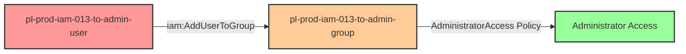

# Self-Escalation Privilege Escalation: iam:AddUserToGroup

* **Category:** Privilege Escalation
* **Sub-Category:** self-escalation
* **Path Type:** self-escalation
* **Target:** to-admin
* **Environments:** prod
* **Cost Estimate:** $0/mo
* **Pathfinding.cloud ID:** iam-013
* **Technique:** Self-escalation via iam:AddUserToGroup to admin group
* **Terraform Variable:** `enable_single_account_privesc_self_escalation_to_admin_iam_013_iam_addusertogroup`
* **Schema Version:** 1.0.0
* **Attack Path:** starting_user → (iam:AddUserToGroup) → add self to admin group → admin access
* **Attack Principals:** `arn:aws:iam::{account_id}:user/pl-prod-iam-013-to-admin-user`; `arn:aws:iam::{account_id}:group/pl-prod-iam-013-to-admin-group`
* **Required Permissions:** `iam:AddUserToGroup` on `*`
* **Helpful Permissions:** `iam:ListGroups` (Discover groups to target); `iam:GetGroup` (View group members and attached policies); `iam:ListAttachedGroupPolicies` (Identify groups with admin permissions)
* **MITRE Tactics:** TA0004 - Privilege Escalation, TA0003 - Persistence
* **MITRE Techniques:** T1098 - Account Manipulation, T1098.001 - Additional Cloud Credentials

## Attack Overview

This scenario demonstrates a privilege escalation vulnerability where a user has permission to add themselves to an administrative group. The attacker can use the `iam:AddUserToGroup` permission to add themselves to a group with `AdministratorAccess`, thereby gaining full administrator permissions.

This is a particularly dangerous misconfiguration because it allows for self-escalation with a single API call. The vulnerability often occurs when administrators grant users the ability to manage group memberships without proper resource constraints, inadvertently allowing users to add themselves to privileged groups.

### MITRE ATT&CK Mapping

- **Tactic**: Privilege Escalation (TA0004), Persistence (TA0003)
- **Technique**: T1098.003 - Account Manipulation: Additional Cloud Roles
- **Sub-technique**: Adding users to privileged groups

### Principals in the attack path

- `arn:aws:iam::PROD_ACCOUNT:user/pl-prod-iam-013-to-admin-user`
- `arn:aws:iam::PROD_ACCOUNT:group/pl-prod-iam-013-to-admin-group`

### Attack Path Diagram



### Attack Steps

1. **Scaffolding aka Initial Access**: Attacker has compromised credentials for `pl-prod-iam-013-to-admin-user` (provided via Terraform outputs)
2. **Self-Escalation**: User executes `iam:AddUserToGroup` to add themselves to `pl-prod-iam-013-to-admin-group`
3. **Administrator Access**: User immediately gains full administrator access via the group's `AdministratorAccess` managed policy
4. **Verification**: Verify administrator access by listing IAM users

### Scenario specific resources created

| ARN | Purpose |
| -- | -- |
| `arn:aws:iam::PROD_ACCOUNT:user/pl-prod-iam-013-to-admin-user` | Starting principal with AddUserToGroup permission |
| `arn:aws:iam::PROD_ACCOUNT:group/pl-prod-iam-013-to-admin-group` | Admin group with AdministratorAccess policy |
| Inline policy on pl-prod-iam-013-to-admin-user | Allows iam:AddUserToGroup on the admin group |

## Attack Lab

### Prerequisites

1. Install the `plabs` CLI:
   ```bash
   brew install pathfinding-labs/tap/plabs
   ```
2. Configure your AWS profiles in `~/.plabs/plabs.yaml` (or run `plabs init` if you haven't already)

### Deploy with plabs non-interactive

```bash
plabs enable enable_single_account_privesc_self_escalation_to_admin_iam_013_iam_addusertogroup
plabs apply
```

### Deploy with plabs tui

1. Launch the TUI: `plabs`
2. Navigate to this scenario in the scenarios list
3. Press `space` to enable it
4. Press `d` to deploy

### Executing the automated demo_attack script

The script will:
1. Display a step-by-step walkthrough with color-coded output
2. Show the commands being executed and their results
3. Verify successful privilege escalation
4. Output standardized test results for automation

#### Resources created by attack script

- Group membership: adds `pl-prod-iam-013-to-admin-user` to `pl-prod-iam-013-to-admin-group`

#### With plabs non-interactive

```bash
plabs demo --list
plabs demo iam-013-iam-addusertogroup
```

#### With plabs tui

1. Launch the TUI: `plabs`
2. Navigate to this scenario in the scenarios list
3. Press `r` to run the demo script

### Cleanup

#### With plabs non-interactive

```bash
plabs cleanup --list
plabs cleanup iam-013-iam-addusertogroup
```

#### With plabs tui

1. Launch the TUI: `plabs`
2. Navigate to this scenario in the scenarios list
3. Press `c` to run the cleanup script

### Teardown with plabs non-interactive

```bash
plabs disable enable_single_account_privesc_self_escalation_to_admin_iam_013_iam_addusertogroup
plabs apply
```

### Teardown with plabs tui

1. Launch the TUI: `plabs`
2. Navigate to this scenario in the scenarios list
3. Press `space` to disable it
4. Press `D` to destroy

## Detecting Misconfiguration (CSPM)

### What CSPM tools should detect

- IAM user has `iam:AddUserToGroup` permission without resource constraints, allowing addition to any group including admin groups
- Privilege escalation path detected: `pl-prod-iam-013-to-admin-user` can add itself to `pl-prod-iam-013-to-admin-group` which has `AdministratorAccess`
- IAM group with `AdministratorAccess` policy has open membership (no SCP or permission boundary preventing self-addition)

### Prevention recommendations

- Avoid granting `iam:AddUserToGroup` permissions on privileged groups
- Use resource-based conditions to restrict which groups users can add members to
- Implement SCPs to prevent adding users to administrative groups
- Monitor CloudTrail for `AddUserToGroup` API calls on privileged groups
- Enable MFA requirements for sensitive IAM operations
- Use IAM Access Analyzer to identify privilege escalation paths
- Require approval workflows for group membership changes to administrative groups

## Detection Abuse (CloudSIEM)

### CloudTrail events to monitor

- `IAM: AddUserToGroup` — User added to an IAM group; critical when the target group has elevated or administrative permissions attached

### Detonation logs

_Detonation log integration (Stratus Red Team / Grimoire) is planned for a future release._
