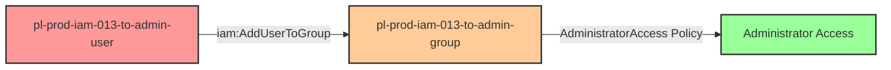

# Self-Escalation Privilege Escalation: iam:AddUserToGroup

* **Category:** Privilege Escalation
* **Sub-Category:** self-escalation
* **Path Type:** self-escalation
* **Target:** to-admin
* **Environments:** prod
* **Pathfinding.cloud ID:** iam-013
* **Technique:** Self-escalation via iam:AddUserToGroup to admin group

## Overview

This scenario demonstrates a privilege escalation vulnerability where a user has permission to add themselves to an administrative group. The attacker can use the `iam:AddUserToGroup` permission to add themselves to a group with `AdministratorAccess`, thereby gaining full administrator permissions.

This is a particularly dangerous misconfiguration because it allows for self-escalation with a single API call. The vulnerability often occurs when administrators grant users the ability to manage group memberships without proper resource constraints, inadvertently allowing users to add themselves to privileged groups.

## Understanding the attack scenario

### Principals in the attack path

- `arn:aws:iam::PROD_ACCOUNT:user/pl-prod-iam-013-to-admin-user`
- `arn:aws:iam::PROD_ACCOUNT:group/pl-prod-iam-013-to-admin-group`

### Attack Path Diagram



### Attack Steps

1. **Scaffolding aka Initial Access**: Attacker has compromised credentials for `pl-prod-iam-013-to-admin-user` (provided via Terraform outputs)
2. **Self-Escalation**: User executes `iam:AddUserToGroup` to add themselves to `pl-prod-iam-013-to-admin-group`
3. **Administrator Access**: User immediately gains full administrator access via the group's `AdministratorAccess` managed policy
4. **Verification**: Verify administrator access by listing IAM users

### Scenario specific resources created

| ARN | Purpose |
| -- | -- |
| `arn:aws:iam::PROD_ACCOUNT:user/pl-prod-iam-013-to-admin-user` | Starting principal with AddUserToGroup permission |
| `arn:aws:iam::PROD_ACCOUNT:group/pl-prod-iam-013-to-admin-group` | Admin group with AdministratorAccess policy |
| Inline policy on pl-prod-iam-013-to-admin-user | Allows iam:AddUserToGroup on the admin group |

## Executing the attack

### Using the automated demo_attack.sh

To demonstrate the privilege escalation path, run the provided demo script:

```bash
cd modules/scenarios/single-account/privesc-self-escalation/to-admin/iam-013-iam-addusertogroup
./demo_attack.sh
```

The script will:
1. Display a step-by-step walkthrough with color-coded output
2. Show the commands being executed and their results
3. Verify successful privilege escalation
4. Output standardized test results for automation

### Cleaning up the attack artifacts

After demonstrating the attack, clean up the group membership added during the demo:

```bash
cd modules/scenarios/single-account/privesc-self-escalation/to-admin/iam-013-iam-addusertogroup
./cleanup_attack.sh
```

## Detection and prevention


### MITRE ATT&CK Mapping

- **Tactic**: Privilege Escalation (TA0004), Persistence (TA0003)
- **Technique**: T1098.003 - Account Manipulation: Additional Cloud Roles
- **Sub-technique**: Adding users to privileged groups


## Prevention recommendations

- Avoid granting `iam:AddUserToGroup` permissions on privileged groups
- Use resource-based conditions to restrict which groups users can add members to
- Implement SCPs to prevent adding users to administrative groups
- Monitor CloudTrail for `AddUserToGroup` API calls on privileged groups
- Enable MFA requirements for sensitive IAM operations
- Use IAM Access Analyzer to identify privilege escalation paths
- Require approval workflows for group membership changes to administrative groups
