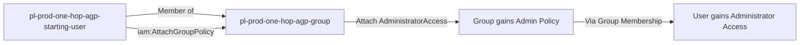

# One-Hop Privilege Escalation: iam:AttachGroupPolicy

**Scenario Type:** One-Hop
**Target:** Admin Access
**Technique:** Self-escalation via attaching admin policy to own group

## Overview

This scenario demonstrates a privilege escalation vulnerability where an IAM user has permission to attach managed policies to a group they are a member of. The attacker can use `iam:AttachGroupPolicy` to attach the `AdministratorAccess` managed policy to their own group, thereby gaining administrator access through group membership.

## Understanding the attack scenario

### Principals in the attack path

- `arn:aws:iam::PROD_ACCOUNT:user/pl-prod-one-hop-agp-starting-user` (Scenario-specific starting user)
- `arn:aws:iam::PROD_ACCOUNT:group/pl-prod-one-hop-agp-group` (IAM group that the user is a member of)

### Attack Path Diagram



### Attack Steps

1. **Initial Access**: Start as `pl-prod-one-hop-agp-starting-user` (credentials provided via Terraform outputs)
2. **Identify Group**: User is a member of `pl-prod-one-hop-agp-group`
3. **Attach Admin Policy**: Use `iam:AttachGroupPolicy` to attach `arn:aws:iam::aws:policy/AdministratorAccess` to the group
4. **Verification**: Verify administrator access via group membership

### Scenario specific resources created

| ARN | Purpose |
| -- | -- |
| `arn:aws:iam::PROD_ACCOUNT:user/pl-prod-one-hop-agp-starting-user` | Scenario-specific starting user with access keys |
| `arn:aws:iam::PROD_ACCOUNT:group/pl-prod-one-hop-agp-group` | IAM group that the user belongs to |
| `arn:aws:iam::PROD_ACCOUNT:policy/pl-prod-one-hop-attachgrouppolicy-policy` | Allows `iam:AttachGroupPolicy` on the group |

## Executing the attack

### Using the automated demo_attack.sh

To demonstrate the privilege escalation path, run the provided demo script:

```bash
cd modules/scenarios/single-account/privesc-self-escalation/to-admin/iam-attachgrouppolicy
./demo_attack.sh
```

The script will:
1. Display a step-by-step walkthrough with color-coded output
2. Show the commands being executed and their results
3. Verify successful privilege escalation
4. Output standardized test results for automation

### Cleaning up the attack artifacts

After demonstrating the attack, clean up the attached policy:

```bash
cd modules/scenarios/single-account/privesc-self-escalation/to-admin/iam-attachgrouppolicy
./cleanup_attack.sh
```

## Detection and prevention


### MITRE ATT&CK Mapping

- **Tactic**: Privilege Escalation
- **Technique**: T1098.003 - Account Manipulation: Additional Cloud Roles
- **Sub-technique**: Modifying group policies to gain elevated privileges


## Prevention recommendations

- Avoid granting `iam:AttachGroupPolicy` permissions to users who are members of the target group
- Use resource-based conditions to restrict which groups can have policies attached
- Implement SCPs to prevent policy attachment to sensitive groups
- Monitor CloudTrail for `AttachGroupPolicy` API calls, especially for administrative policies
- Enable MFA requirements for sensitive IAM operations
- Use IAM Access Analyzer to identify privilege escalation paths
- Implement a least-privilege model where users cannot modify their own effective permissions
