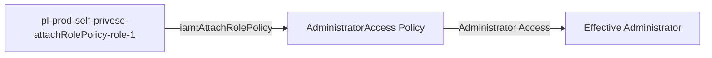

# One-Hop Privilege Escalation: iam:AttachRolePolicy

**Scenario Type:** One-Hop
**Target:** Admin Access
**Technique:** Self-modification via iam:AttachRolePolicy

## Overview

This scenario demonstrates a privilege escalation vulnerability where a role can attach managed policies to itself using `iam:AttachRolePolicy`. The attacker starts with minimal permissions but can grant themselves administrator access by attaching the AWS-managed AdministratorAccess policy to their own role.

## Understanding the attack scenario

### Principals in the attack path

- `arn:aws:iam::PROD_ACCOUNT:user/pl-pathfinder-starting-user-prod`
- `arn:aws:iam::PROD_ACCOUNT:role/pl-prod-self-privesc-attachRolePolicy-role-1`

### Attack Path Diagram



### Attack Steps

1. **Scaffolding aka Initial Access**: `pl-pathfinder-starting-user-prod` assumes the role `pl-prod-self-privesc-attachRolePolicy-role-1` to begin the scenario
2. **Attach Admin Policy**: `pl-prod-self-privesc-attachRolePolicy-role-1` uses `iam:AttachRolePolicy` to attach the AWS-managed AdministratorAccess policy to itself
3. **Verification**: Verify administrator access with the modified role

### Scenario specific resources created

| ARN | Purpose |
| -- | -- |
| `arn:aws:iam::PROD_ACCOUNT:role/pl-prod-self-privesc-attachRolePolicy-role-1` | Starting principal with policy attachment capability |
| `arn:aws:iam::PROD_ACCOUNT:policy/pl-prod-self-privesc-attachRolePolicy-policy` | Allows `iam:AttachRolePolicy` on the role itself |

## Executing the attack

### Using the automated demo_attack.sh

To demonstrate the privilege escalation path, run the provided demo script:

```bash
cd modules/scenarios/single-account/privesc-self-escalation/to-admin/iam-attachrolepolicy
./demo_attack.sh
```

The script will:
1. Display a step-by-step walkthrough with color-coded output
2. Show the commands being executed and their results
3. Verify successful privilege escalation
4. Output standardized test results for automation

### Cleaning up the attack artifacts

After demonstrating the attack, clean up the attached policies created during the demo:

```bash
cd modules/scenarios/single-account/privesc-self-escalation/to-admin/iam-attachrolepolicy
./cleanup_attack.sh
```

## Detection and prevention


### MITRE ATT&CK Mapping

- **Tactic**: Privilege Escalation
- **Technique**: T1078.004 - Valid Accounts: Cloud Accounts
- **Sub-technique**: Abuse of IAM Permissions


## Prevention recommendations

- Avoid granting `iam:AttachRolePolicy` permissions on roles
- If required, use resource-based conditions to restrict which roles can be modified
- Implement SCPs to prevent self-attachment of policies
- Monitor CloudTrail for `AttachRolePolicy` API calls, especially when roles modify themselves
- Enable MFA requirements for sensitive operations
- Use IAM Access Analyzer to identify privilege escalation paths
- Restrict attachment of high-privilege AWS-managed policies like AdministratorAccess
- Use conditions to limit which policies can be attached (e.g., by policy name pattern)
