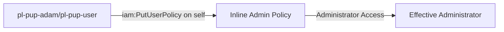

# Self-Escalation Privilege Escalation: iam:PutUserPolicy

* **Category:** Privilege Escalation
* **Sub-Category:** self-escalation
* **Path Type:** self-escalation
* **Target:** to-admin
* **Environments:** prod
* **Pathfinding.cloud ID:** iam-007
* **Technique:** Self-modification via iam:PutUserPolicy to attach inline admin policy

## Overview

This scenario demonstrates a privilege escalation vulnerability where a principal has permission to put inline policies on IAM users, including themselves. The attacker can use `iam:PutUserPolicy` to attach an inline policy granting administrator access to their own user, immediately escalating their privileges.

## Understanding the attack scenario

### Principals in the attack path

- `arn:aws:iam::PROD_ACCOUNT:user/pl-pathfinding-starting-user-prod` (starting point)
- `arn:aws:iam::PROD_ACCOUNT:role/pl-pup-adam` (role variant)
- `arn:aws:iam::PROD_ACCOUNT:user/pl-pup-user` (user variant)

### Attack Path Diagram



### Attack Steps

1. **Scaffolding aka Initial Access**: Either:
   - `pl-pathfinding-starting-user-prod` assumes the role `pl-pup-adam` to begin the scenario, OR
   - Use the access keys for `pl-pup-user` directly
2. **Attach Inline Policy**: Use `iam:PutUserPolicy` to attach an inline policy granting AdministratorAccess to the current user
3. **Immediate Escalation**: The inline policy takes effect immediately, granting admin access
4. **Verification**: Verify administrator access with the escalated permissions

### Scenario specific resources created

| ARN | Purpose |
| -- | -- |
| `arn:aws:iam::PROD_ACCOUNT:role/pl-pup-adam` | Role with PutUserPolicy permission |
| `arn:aws:iam::PROD_ACCOUNT:user/pl-pup-user` | User with PutUserPolicy permission |
| `arn:aws:iam::PROD_ACCOUNT:policy/pl-prod-one-hop-putuserpolicy-policy` | Policy allowing `iam:PutUserPolicy` on any resource |

## Executing the attack

### Using the automated demo_attack.sh

To demonstrate the privilege escalation path, run the provided demo script:

```bash
cd modules/scenarios/single-account/privesc-self-escalation/to-admin/iam-putuserpolicy
./demo_attack.sh
```

The script will:
1. Display a step-by-step walkthrough with color-coded output
2. Show the commands being executed and their results
3. Verify successful privilege escalation
4. Output standardized test results for automation

### Cleaning up the attack artifacts

After demonstrating the attack, clean up the inline policy added during the demo:

```bash
cd modules/scenarios/single-account/privesc-self-escalation/to-admin/iam-putuserpolicy
./cleanup_attack.sh
```

## Detection and prevention

### MITRE ATT&CK Mapping

- **Tactic**: Privilege Escalation, Persistence
- **Technique**: T1098 - Account Manipulation
- **Sub-technique**: T1098.001 - Additional Cloud Credentials
- **Additional**: T1078.004 - Cloud Accounts

## Prevention recommendations

- Never grant `iam:PutUserPolicy` permissions without strict resource constraints
- Use SCPs to prevent inline policy attachments on privileged users
- Implement least privilege - users should not be able to modify their own permissions
- Monitor CloudTrail for `PutUserPolicy` API calls, especially self-modifications
- Use IAM Access Analyzer to identify privilege escalation paths
- Prefer managed policies over inline policies for better visibility and control
- Enable MFA requirements for sensitive IAM operations