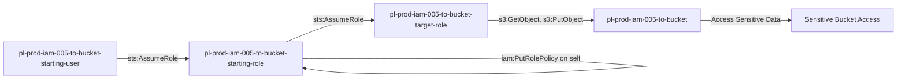

# One-Hop Privilege Escalation: iam:PutRolePolicy

* **Category:** Privilege Escalation
* **Sub-Category:** self-escalation
* **Path Type:** self-escalation
* **Target:** to-bucket
* **Environments:** prod
* **Cost Estimate:** $0/mo
* **Pathfinding.cloud ID:** iam-005
* **Technique:** Role with iam:PutRolePolicy on itself can add inline policy granting S3 bucket access
* **Terraform Variable:** `enable_single_account_privesc_self_escalation_to_bucket_iam_005_iam_putrolepolicy`
* **Schema Version:** 1.0.0
* **Attack Path:** starting_user → (AssumeRole) → starting_role → (iam:PutRolePolicy on self) → inline S3 policy → (AssumeRole) → target_role → bucket access
* **Attack Principals:** `arn:aws:iam::{account_id}:user/pl-prod-iam-005-to-bucket-starting-user`; `arn:aws:iam::{account_id}:role/pl-prod-iam-005-to-bucket-starting-role`; `arn:aws:iam::{account_id}:role/pl-prod-iam-005-to-bucket-target-role`; `arn:aws:s3:::pl-prod-iam-005-to-bucket-{account_id}`
* **Required Permissions:** `iam:PutRolePolicy` on `arn:aws:iam::*:role/pl-prod-iam-005-to-bucket-starting-role`
* **Helpful Permissions:** `iam:GetRolePolicy` (View existing inline policies on the role); `iam:ListRolePolicies` (List all inline policies attached to the role); `s3:ListBucket` (Verify bucket access after escalation)
* **MITRE Tactics:** TA0004 - Privilege Escalation, TA0009 - Collection
* **MITRE Techniques:** T1098 - Account Manipulation, T1530 - Data from Cloud Storage Object

## Attack Overview

This scenario demonstrates privilege escalation where a role with `iam:PutRolePolicy` on itself can modify its own inline policy to gain S3 bucket access, then assume a target role with bucket permissions. This is a self-escalation scenario where the starting role first adds permissions to itself before accessing the target bucket.

### MITRE ATT&CK Mapping

- **Tactic**: Privilege Escalation, Collection
- **Technique**: T1078.004 - Valid Accounts: Cloud Accounts
- **Sub-technique**: T1530 - Data from Cloud Storage Object

### Principals in the attack path

- `arn:aws:iam::PROD_ACCOUNT:user/pl-prod-iam-005-to-bucket-starting-user`
- `arn:aws:iam::PROD_ACCOUNT:role/pl-prod-iam-005-to-bucket-starting-role`
- `arn:aws:iam::PROD_ACCOUNT:role/pl-prod-iam-005-to-bucket-target-role`
- `arn:aws:s3:::pl-prod-iam-005-to-bucket-ACCOUNT_ID-SUFFIX`

### Attack Path Diagram



### Attack Steps

1. **Initial Access**: `pl-prod-iam-005-to-bucket-starting-user` assumes the role `pl-prod-iam-005-to-bucket-starting-role` to begin the scenario
2. **Self-Escalation**: Use `iam:PutRolePolicy` to add an inline policy to the starting role (self) granting S3 bucket access
3. **Assume Target Role**: Assume the `pl-prod-iam-005-to-bucket-target-role` which has S3 permissions
4. **Access S3 Bucket**: Read and download sensitive data from the target bucket

### Scenario specific resources created

| ARN | Purpose |
| -- | -- |
| `arn:aws:iam::PROD_ACCOUNT:user/pl-prod-iam-005-to-bucket-starting-user` | Starting user with AssumeRole permission |
| `arn:aws:iam::PROD_ACCOUNT:role/pl-prod-iam-005-to-bucket-starting-role` | Starting role with PutRolePolicy permission on itself |
| `arn:aws:iam::PROD_ACCOUNT:role/pl-prod-iam-005-to-bucket-target-role` | Target role with S3 bucket permissions |
| `arn:aws:iam::PROD_ACCOUNT:policy/pl-prod-iam-005-to-bucket-access-policy` | Grants S3 read/write access to target bucket |
| `arn:aws:s3:::pl-prod-iam-005-to-bucket-ACCOUNT_ID-SUFFIX` | Target S3 bucket containing sensitive data |
| `arn:aws:s3:::pl-prod-iam-005-to-bucket-ACCOUNT_ID-SUFFIX/sensitive-data.txt` | Sensitive file in the target bucket |

## Attack Lab

### Prerequisites

1. Install the `plabs` CLI:
   ```bash
   brew install pathfinding-labs/tap/plabs
   ```
2. Configure your AWS profiles in `~/.plabs/plabs.yaml` (or run `plabs init` if you haven't already)

### Deploy with plabs non-interactive

```bash
plabs enable enable_single_account_privesc_self_escalation_to_bucket_iam_005_iam_putrolepolicy
plabs apply
```

### Deploy with plabs tui

1. Launch the TUI: `plabs`
2. Navigate to this scenario in the scenarios list
3. Press `space` to enable it
4. Press `d` to deploy

### Executing the automated demo_attack script

The script will:
1. Display a step-by-step walkthrough with color-coded output
2. Show the commands being executed and their results
3. Verify successful privilege escalation to bucket access
4. Output standardized test results for automation

#### Resources created by attack script

- Inline IAM policy added to `pl-prod-iam-005-to-bucket-starting-role` granting S3 bucket access

#### With plabs non-interactive

```bash
plabs demo --list
plabs demo iam-005-iam-putrolepolicy
```

#### With plabs tui

1. Launch the TUI: `plabs`
2. Navigate to this scenario in the scenarios list
3. Press `r` to run the demo script

### Cleanup

#### With plabs non-interactive

```bash
plabs cleanup --list
plabs cleanup iam-005-iam-putrolepolicy
```

#### With plabs tui

1. Launch the TUI: `plabs`
2. Navigate to this scenario in the scenarios list
3. Press `c` to run the cleanup script

### Teardown with plabs non-interactive

```bash
plabs disable enable_single_account_privesc_self_escalation_to_bucket_iam_005_iam_putrolepolicy
plabs apply
```

### Teardown with plabs tui

1. Launch the TUI: `plabs`
2. Navigate to this scenario in the scenarios list
3. Press `space` to disable it
4. Press `D` to destroy

## Detecting Misconfiguration (CSPM)

### What CSPM tools should detect

- IAM role (`pl-prod-iam-005-to-bucket-starting-role`) has `iam:PutRolePolicy` permission scoped to itself, enabling self-escalation
- Privilege escalation path exists: starting role can modify its own inline policy to gain S3 bucket access
- Role chain allows indirect access to sensitive S3 bucket via intermediate role assumption

### Prevention recommendations

- Avoid granting `iam:PutRolePolicy` permissions on roles (especially on self)
- Use resource-based conditions to restrict which roles can be modified
- Implement SCPs to prevent privilege escalation techniques
- Monitor CloudTrail for `PutRolePolicy` API calls on the same role followed by `AssumeRole` and S3 access
- Enable MFA requirements for sensitive operations
- Use IAM Access Analyzer to identify privilege escalation paths
- Implement S3 bucket policies that restrict access even for privileged roles
- Enable S3 access logging to track data access patterns

## Detection Abuse (CloudSIEM)

### CloudTrail events to monitor

- `IAM: PutRolePolicy` — Inline policy added to a role; critical when the target role is the same as the calling principal (self-escalation)
- `STS: AssumeRole` — Role assumption event; watch for the starting role assuming the target role after a PutRolePolicy call
- `S3: GetObject` — Object retrieved from S3 bucket; monitor for access by roles that recently had inline policies added

### Detonation logs

_Detonation log integration (Stratus Red Team / Grimoire) is planned for a future release._

