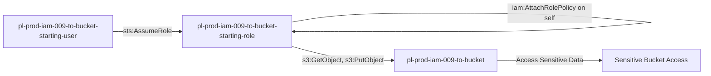

# One-Hop Privilege Escalation: iam:AttachRolePolicy

* **Category:** Privilege Escalation
* **Sub-Category:** self-escalation
* **Path Type:** self-escalation
* **Target:** to-bucket
* **Environments:** prod
* **Cost Estimate:** $0/mo
* **Pathfinding.cloud ID:** iam-009
* **Technique:** Role with iam:AttachRolePolicy on itself can attach policy granting S3 bucket access
* **Terraform Variable:** `enable_single_account_privesc_self_escalation_to_bucket_iam_009_iam_attachrolepolicy`
* **Schema Version:** 1.0.0
* **Attack Path:** starting_user → (AssumeRole) → privesc_role → (iam:AttachRolePolicy on self) → attach S3 policy → bucket access
* **Attack Principals:** `arn:aws:iam::{account_id}:user/pl-pathfinding-starting-user-prod`; `arn:aws:iam::{account_id}:role/pl-prod-iam-009-to-bucket-starting-role`; `arn:aws:s3:::pl-prod-iam-009-to-bucket-{account_id}`
* **Required Permissions:** `iam:AttachRolePolicy` on `arn:aws:iam::*:role/pl-prod-iam-009-to-bucket-starting-role`
* **Helpful Permissions:** `iam:ListAttachedRolePolicies` (List managed policies attached to the role); `iam:ListPolicies` (Discover available managed policies); `s3:ListBucket` (Verify bucket access after escalation)
* **MITRE Tactics:** TA0004 - Privilege Escalation, TA0009 - Collection
* **MITRE Techniques:** T1098 - Account Manipulation, T1530 - Data from Cloud Storage Object

## Attack Overview

This scenario demonstrates privilege escalation where an attacker can attach managed policies to another role using `iam:AttachRolePolicy`, then assume that role to gain access to a sensitive S3 bucket. The attacker attaches the AWS-managed AmazonS3FullAccess policy to a role they can assume, granting them access to all S3 buckets in the account.

### MITRE ATT&CK Mapping

- **Tactic**: Privilege Escalation, Collection
- **Technique**: T1078.004 - Valid Accounts: Cloud Accounts
- **Sub-technique**: T1530 - Data from Cloud Storage Object

### Principals in the attack path

- `arn:aws:iam::PROD_ACCOUNT:user/pl-prod-iam-009-to-bucket-starting-user`
- `arn:aws:iam::PROD_ACCOUNT:role/pl-prod-iam-009-to-bucket-starting-role`
- `arn:aws:s3:::pl-prod-iam-009-to-bucket-ACCOUNT_ID-SUFFIX`

### Attack Path Diagram



### Attack Steps

1. **Initial Access**: Use credentials for `pl-prod-iam-009-to-bucket-starting-user`
2. **Assume Starting Role**: Assume `pl-prod-iam-009-to-bucket-starting-role`
3. **Self-Escalation**: Use `iam:AttachRolePolicy` to attach S3 bucket access policy to self (the current role)
4. **Access S3 Bucket**: Read and download sensitive data from the target bucket

### Scenario specific resources created

| ARN | Purpose |
| -- | -- |
| `arn:aws:iam::PROD_ACCOUNT:user/pl-prod-iam-009-to-bucket-starting-user` | Starting user with credentials |
| `arn:aws:iam::PROD_ACCOUNT:role/pl-prod-iam-009-to-bucket-starting-role` | Starting role with AttachRolePolicy permission on itself |
| `arn:aws:iam::PROD_ACCOUNT:policy/pl-prod-iam-009-to-bucket-access-policy` | Grants S3 read/write access to target bucket (to be attached during escalation) |
| `arn:aws:s3:::pl-prod-iam-009-to-bucket-ACCOUNT_ID-SUFFIX` | Target S3 bucket containing sensitive data |
| `arn:aws:s3:::pl-prod-iam-009-to-bucket-ACCOUNT_ID-SUFFIX/sensitive-data.txt` | Sensitive file in the target bucket |

## Attack Lab

### Prerequisites

1. Install the `plabs` CLI:
   ```bash
   brew install pathfinding-labs/tap/plabs
   ```
2. Configure your AWS profiles in `~/.plabs/plabs.yaml` (or run `plabs init` if you haven't already)

### Deploy with plabs non-interactive

```bash
plabs enable enable_single_account_privesc_self_escalation_to_bucket_iam_009_iam_attachrolepolicy
plabs apply
```

### Deploy with plabs tui

1. Launch the TUI: `plabs`
2. Navigate to this scenario in the scenarios list
3. Press `space` to enable it
4. Press `d` to deploy

### Executing the automated demo_attack script

The script will:
1. Display a step-by-step walkthrough with color-coded output
2. Show the commands being executed and their results
3. Verify successful privilege escalation to bucket access
4. Output standardized test results for automation

#### Resources created by attack script

- Managed policy attachment: `AmazonS3FullAccess` (or bucket-specific policy) attached to `pl-prod-iam-009-to-bucket-starting-role`

#### With plabs non-interactive

```bash
plabs demo --list
plabs demo iam-009-iam-attachrolepolicy
```

#### With plabs tui

1. Launch the TUI: `plabs`
2. Navigate to this scenario in the scenarios list
3. Press `r` to run the demo script

### Cleanup

#### With plabs non-interactive

```bash
plabs cleanup --list
plabs cleanup iam-009-iam-attachrolepolicy
```

#### With plabs tui

1. Launch the TUI: `plabs`
2. Navigate to this scenario in the scenarios list
3. Press `c` to run the cleanup script

### Teardown with plabs non-interactive

```bash
plabs disable enable_single_account_privesc_self_escalation_to_bucket_iam_009_iam_attachrolepolicy
plabs apply
```

### Teardown with plabs tui

1. Launch the TUI: `plabs`
2. Navigate to this scenario in the scenarios list
3. Press `space` to disable it
4. Press `D` to destroy

## Detecting Misconfiguration (CSPM)

### What CSPM tools should detect

- IAM role `pl-prod-iam-009-to-bucket-starting-role` has `iam:AttachRolePolicy` permission scoped to itself, enabling self-escalation
- A role with `iam:AttachRolePolicy` on its own ARN can attach any managed policy, including high-privilege policies like `AmazonS3FullAccess`
- Privilege escalation path exists: starting user can assume the role and then escalate to gain S3 bucket access
- No SCP or permission boundary prevents the role from attaching additional policies to itself

### Prevention recommendations

- Avoid granting `iam:AttachRolePolicy` permissions on other roles
- Use resource-based conditions to restrict which roles can be modified
- Implement SCPs to prevent privilege escalation techniques
- Monitor CloudTrail for `AttachRolePolicy` API calls followed by `AssumeRole` and S3 access
- Enable MFA requirements for sensitive operations
- Use IAM Access Analyzer to identify privilege escalation paths
- Restrict attachment of high-privilege AWS-managed policies like AmazonS3FullAccess
- Implement S3 bucket policies that restrict access even for privileged roles
- Enable S3 access logging to track data access patterns

## Detection Abuse (CloudSIEM)

### CloudTrail events to monitor

- `IAM: AttachRolePolicy` — Managed policy attached to a role; critical when the target role is the same as the calling principal (self-escalation)
- `STS: AssumeRole` — Role assumption event; look for the starting user assuming the privesc role prior to the policy attachment
- `S3: GetObject` — Object retrieved from S3 bucket; high severity when preceded by an `AttachRolePolicy` event on the accessing role
- `S3: ListBucket` — Bucket enumeration; watch for new access patterns following a policy attachment event

### Detonation logs

_Detonation log integration (Stratus Red Team / Grimoire) is planned for a future release._

