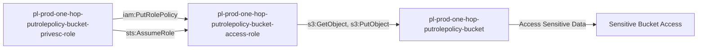

# One-Hop Privilege Escalation: iam:PutRolePolicy

**Scenario Type:** One-Hop
**Target:** S3 Bucket Access
**Technique:** iam:PutRolePolicy on another role with S3 access

## Overview

This scenario demonstrates privilege escalation where an attacker can modify another role's inline policy using `iam:PutRolePolicy`, then assume that role to gain access to a sensitive S3 bucket. Unlike self-modification scenarios, this involves modifying a different role's permissions and then assuming it to access sensitive data.

## Understanding the attack scenario

### Principals in the attack path

- `arn:aws:iam::PROD_ACCOUNT:user/pl-pathfinder-starting-user-prod`
- `arn:aws:iam::PROD_ACCOUNT:role/pl-prod-one-hop-putrolepolicy-bucket-privesc-role`
- `arn:aws:iam::PROD_ACCOUNT:role/pl-prod-one-hop-putrolepolicy-bucket-access-role`
- `arn:aws:s3:::pl-prod-one-hop-putrolepolicy-bucket-ACCOUNT_ID-SUFFIX`

### Attack Path Diagram



### Attack Steps

1. **Scaffolding aka Initial Access**: `pl-pathfinder-starting-user-prod` assumes the role `pl-prod-one-hop-putrolepolicy-bucket-privesc-role` to begin the scenario
2. **Modify Target Role Trust Policy**: Use `iam:PutRolePolicy` to add an inline policy to `pl-prod-one-hop-putrolepolicy-bucket-access-role` allowing the privesc role to assume it
3. **Assume Bucket Access Role**: Assume the `pl-prod-one-hop-putrolepolicy-bucket-access-role` which has S3 permissions
4. **Access S3 Bucket**: Read and download sensitive data from the target bucket

### Scenario specific resources created

| ARN | Purpose |
| -- | -- |
| `arn:aws:iam::PROD_ACCOUNT:role/pl-prod-one-hop-putrolepolicy-bucket-privesc-role` | Starting principal with PutRolePolicy permission |
| `arn:aws:iam::PROD_ACCOUNT:policy/pl-prod-one-hop-putrolepolicy-bucket-privesc-policy` | Allows `iam:PutRolePolicy` and `sts:AssumeRole` on bucket-access-role |
| `arn:aws:iam::PROD_ACCOUNT:role/pl-prod-one-hop-putrolepolicy-bucket-access-role` | Target role with S3 bucket permissions |
| `arn:aws:iam::PROD_ACCOUNT:policy/pl-prod-one-hop-putrolepolicy-bucket-access-policy` | Grants S3 read/write access to target bucket |
| `arn:aws:s3:::pl-prod-one-hop-putrolepolicy-bucket-ACCOUNT_ID-SUFFIX` | Target S3 bucket containing sensitive data |
| `arn:aws:s3:::pl-prod-one-hop-putrolepolicy-bucket-ACCOUNT_ID-SUFFIX/sensitive-data.txt` | Sensitive file in the target bucket |

## Executing the attack

### Using the automated demo_attack.sh

To demonstrate the privilege escalation path, run the provided demo script:

```bash
cd modules/scenarios/single-account/privesc-one-hop/to-bucket/iam-putrolepolicy
./demo_attack.sh
```

The script will:
1. Display a step-by-step walkthrough with color-coded output
2. Show the commands being executed and their results
3. Verify successful privilege escalation to bucket access
4. Output standardized test results for automation

### Cleaning up the attack artifacts

After demonstrating the attack, clean up the inline policy added during the demo:

```bash
cd modules/scenarios/single-account/privesc-one-hop/to-bucket/iam-putrolepolicy
./cleanup_attack.sh
```

## Detection and prevention


### MITRE ATT&CK Mapping

- **Tactic**: Privilege Escalation, Collection
- **Technique**: T1078.004 - Valid Accounts: Cloud Accounts
- **Sub-technique**: T1530 - Data from Cloud Storage Object


## Prevention recommendations

- Avoid granting `iam:PutRolePolicy` permissions on other roles
- Use resource-based conditions to restrict which roles can be modified
- Implement SCPs to prevent privilege escalation techniques
- Monitor CloudTrail for `PutRolePolicy` API calls followed by `AssumeRole` and S3 access
- Enable MFA requirements for sensitive operations
- Use IAM Access Analyzer to identify privilege escalation paths
- Implement S3 bucket policies that restrict access even for privileged roles
- Enable S3 access logging to track data access patterns

