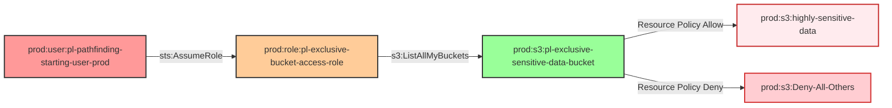

# Exclusive S3 Bucket Access Through Restrictive Resource Policy

* **Category:** Privilege Escalation
* **Sub-Category:** principal-access
* **Path Type:** multi-hop
* **Target:** to-bucket
* **Environments:** prod
* **Cost Estimate:** $0/mo
* **Technique:** Access S3 bucket with exclusive resource policy that denies all except specific role
* **Terraform Variable:** `enable_tool_testing_exclusive_resource_policy`
* **Schema Version:** 1.0.0
* **Attack Path:** starting_user → (AssumeRole) → role_a → (sts:AssumeRole) → exclusive_role → bucket with exclusive policy → bucket access
* **Attack Principals:** `arn:aws:iam::{account_id}:user/pl-pathfinding-starting-user-prod`; `arn:aws:iam::{account_id}:role/pl-prod-role-a`; `arn:aws:iam::{account_id}:role/pl-prod-exclusive-role`; `arn:aws:s3:::pl-exclusive-bucket-{account_id}`
* **Required Permissions:** `sts:AssumeRole` on `arn:aws:iam::*:role/pl-prod-exclusive-role`
* **Helpful Permissions:** `iam:ListRoles` (Discover roles with exclusive bucket access); `s3:GetBucketPolicy` (View bucket resource policy)
* **MITRE Tactics:** TA0004 - Privilege Escalation, TA0009 - Collection
* **MITRE Techniques:** T1078.004 - Valid Accounts: Cloud Accounts, T1530 - Data from Cloud Storage Object

## Attack Overview

This module demonstrates how a role with minimal IAM permissions can access an S3 bucket through a restrictive resource-based policy that explicitly denies access to everyone else, creating an exclusive access scenario.

The attack path shows how a user can assume a role with only `s3:ListAllMyBuckets` permission and still access highly sensitive data in an S3 bucket through a restrictive resource-based policy that denies access to all other principals.

This attack demonstrates a critical security vulnerability with additional complexity: resource policies can grant access even when IAM policies restrict it. A role with very limited permissions can access highly sensitive data through the exclusive access model, and the ability to list buckets can lead to discovering sensitive resources. Shows how complex resource policies can create security blind spots with high impact — full read/write access to highly sensitive S3 data.

### MITRE ATT&CK Mapping

- **Tactics**: TA0004 - Privilege Escalation, TA0009 - Collection
- **Techniques**: T1078.004 - Valid Accounts: Cloud Accounts, T1530 - Data from Cloud Storage Object

### Principals in the attack path

- `arn:aws:iam::{PROD_ACCOUNT}:user/pl-pathfinding-starting-user-prod` (starting user; has permission to assume the exclusive bucket access role)
- `arn:aws:iam::{PROD_ACCOUNT}:role/pl-prod-role-a` (intermediate role)
- `arn:aws:iam::{PROD_ACCOUNT}:role/pl-exclusive-bucket-access-role` (target role; only has `s3:ListAllMyBuckets` in its IAM policy but gains S3 access via resource policy)

### Attack Path Diagram



### Attack Steps

1. **Initial Access**: User `pl-pathfinding-starting-user-prod` has permission to assume the `pl-exclusive-bucket-access-role`
2. **Role Assumption**: User assumes the role which only has `s3:ListAllMyBuckets` permission in its IAM policy
3. **Bucket Discovery**: Role uses its limited IAM permission to list all S3 buckets
4. **Restrictive Resource Policy Access**: The exclusive sensitive bucket has a resource policy that:
   - ALLOWS access only to the specific role
   - DENIES access to all other principals
5. **Exclusive Data Access**: Role can now read, write, and delete objects in the exclusive sensitive bucket
6. **Verification**: Demonstrates that other users are denied access while the exclusive role succeeds

### Scenario specific resources created

| ARN | Purpose |
|-----|---------|
| `arn:aws:iam::{PROD_ACCOUNT}:role/pl-exclusive-bucket-access-role` | Role that trusts the prod starting user; IAM policy contains only `s3:ListAllMyBuckets` |
| `arn:aws:s3:::pl-exclusive-sensitive-data-bucket-{PROD_ACCOUNT}` | Bucket with highly sensitive sample data, encryption enabled, and restrictive resource policy |

## Attack Lab

### Prerequisites

1. Install the `plabs` CLI:
   ```bash
   brew install pathfinding-labs/tap/plabs
   ```
2. Configure your AWS profiles in `~/.plabs/plabs.yaml` (or run `plabs init` if you haven't already)

### Deploy with plabs non-interactive

```bash
plabs enable enable_tool_testing_exclusive_resource_policy
plabs apply
```

### Deploy with plabs tui

1. Launch the TUI: `plabs`
2. Navigate to this scenario in the scenarios list
3. Press `space` to enable it
4. Press `d` to deploy

### Executing the automated demo_attack script

The script will:

1. **Verification**: Checks current identity and permissions
2. **Role Assumption**: Assumes the exclusive bucket access role with minimal IAM permissions
3. **Permission Testing**: Verifies that the role has limited IAM permissions
4. **Bucket Discovery**: Uses `s3:ListAllMyBuckets` to find the exclusive sensitive bucket
5. **Restrictive Resource Policy Access**: Accesses the bucket through the restrictive resource policy
6. **Data Exfiltration**: Reads and writes highly sensitive data
7. **Policy Verification**: Confirms the restrictive policy denies access to others
8. **Access Confirmation**: Verifies that IAM restrictions were bypassed via the resource policy

#### Resources created by attack script

- No persistent attack artifacts are created; the demo reads/writes objects in the exclusive bucket using the pre-provisioned role credentials

#### With plabs non-interactive

```bash
plabs demo --list
plabs demo exclusive-resource-policy
```

#### With plabs tui

1. Launch the TUI: `plabs`
2. Navigate to this scenario in the scenarios list
3. Press `r` to run the demo script

### Executing the attack manually

```bash
# Step 1: Assume the exclusive bucket access role
aws sts assume-role \
  --role-arn arn:aws:iam::{PROD_ACCOUNT}:role/pl-exclusive-bucket-access-role \
  --role-session-name exclusive-access-demo

# Step 2: Export the temporary credentials
export AWS_ACCESS_KEY_ID=<AccessKeyId from above>
export AWS_SECRET_ACCESS_KEY=<SecretAccessKey from above>
export AWS_SESSION_TOKEN=<SessionToken from above>

# Step 3: Verify limited IAM permissions (this should succeed)
aws s3 ls

# Step 4: Access the exclusive bucket via resource policy
aws s3 ls s3://pl-exclusive-sensitive-data-bucket-{PROD_ACCOUNT}
aws s3 cp s3://pl-exclusive-sensitive-data-bucket-{PROD_ACCOUNT}/sensitive-data.txt .

# Step 5: Verify the resource policy denies other principals
# (Use a different role's credentials — the request will be denied)
```

### Cleanup

#### With plabs non-interactive

```bash
plabs cleanup --list
plabs cleanup exclusive-resource-policy
```

#### With plabs tui

1. Launch the TUI: `plabs`
2. Navigate to this scenario in the scenarios list
3. Press `c` to run the cleanup script

### Teardown with plabs non-interactive

```bash
plabs disable enable_tool_testing_exclusive_resource_policy
plabs apply
```

### Teardown with plabs tui

1. Launch the TUI: `plabs`
2. Navigate to this scenario in the scenarios list
3. Press `space` to disable it
4. Press `D` to destroy

## Detecting Misconfiguration (CSPM)

### What CSPM tools should detect

- S3 bucket resource policy grants `s3:GetObject`, `s3:PutObject`, `s3:DeleteObject`, and `s3:ListBucket` to a specific IAM role while explicitly denying all other principals — creating a hidden exclusive-access channel
- IAM role (`pl-exclusive-bucket-access-role`) has no direct S3 permissions in its identity policy yet can fully read and write a sensitive bucket via the bucket resource policy
- S3 bucket resource policy contains an explicit `Deny` on `Principal: "*"` with a `StringNotEquals` condition on `aws:PrincipalArn` — a pattern that is easy to misconfigure and creates blind spots in access reviews
- The combination of a minimal-permission role and an exclusive resource policy means standard IAM analysis tools will underreport actual access

### Prevention recommendations

1. **Principle of Least Privilege**: Avoid granting `s3:ListAllMyBuckets` unless absolutely necessary; prefer scoped `s3:ListBucket` on specific buckets
2. **Resource Policy Auditing**: Regularly audit S3 bucket resource policies for exclusive-access patterns using AWS Access Analyzer or third-party CSPM tools
3. **Access Logging**: Enable S3 server access logging and CloudTrail data events to monitor all bucket access patterns
4. **Conditional Policies**: Strengthen resource policy conditions (e.g., require `aws:SourceVpc` or `aws:PrincipalOrgID`) rather than relying solely on `aws:PrincipalArn`
5. **Policy Testing**: Regularly test effective permissions using `aws iam simulate-principal-policy` and Access Analyzer to surface resource-policy-granted access
6. **Monitoring**: Set up CloudTrail and CloudWatch alerts for `S3: GetObject` and `S3: PutObject` events from roles with no explicit S3 identity policy

## Detection Abuse (CloudSIEM)

### CloudTrail events to monitor

- `STS: AssumeRole` — Role assumption by the starting user; flag when the assumed role has minimal IAM permissions but is known to have exclusive resource-policy access
- `S3: ListBucket` — Bucket enumeration by the exclusive role; precedes data access
- `S3: GetObject` — Object read from the exclusive bucket; critical when the accessing principal has no direct S3 IAM permissions
- `S3: PutObject` — Object write to the exclusive bucket; high severity when the accessing principal's identity policy does not grant S3 write access

### Detonation logs

_Detonation log integration (Stratus Red Team / Grimoire) is planned for a future release._

## Technical Details

### Restrictive Resource Policy Example

The bucket resource policy allows only the specific role and denies everyone else:

```json
{
  "Version": "2012-10-17",
  "Statement": [
    {
      "Sid": "AllowExclusiveBucketAccessRole",
      "Effect": "Allow",
      "Principal": {
        "AWS": "arn:aws:iam::ACCOUNT:role/pl-exclusive-bucket-access-role"
      },
      "Action": [
        "s3:ListBucket",
        "s3:GetObject",
        "s3:PutObject",
        "s3:DeleteObject"
      ],
      "Resource": [
        "arn:aws:s3:::pl-exclusive-sensitive-data-bucket",
        "arn:aws:s3:::pl-exclusive-sensitive-data-bucket/*"
      ]
    },
    {
      "Sid": "DenyAllOtherAccess",
      "Effect": "Deny",
      "Principal": "*",
      "Action": [
        "s3:ListBucket",
        "s3:GetObject",
        "s3:PutObject",
        "s3:DeleteObject"
      ],
      "Resource": [
        "arn:aws:s3:::pl-exclusive-sensitive-data-bucket",
        "arn:aws:s3:::pl-exclusive-sensitive-data-bucket/*"
      ],
      "Condition": {
        "StringNotEquals": {
          "aws:PrincipalArn": "arn:aws:iam::ACCOUNT:role/pl-exclusive-bucket-access-role"
        }
      }
    }
  ]
}
```

### IAM Policy Example

The role's IAM policy is intentionally minimal:

```json
{
  "Version": "2012-10-17",
  "Statement": [
    {
      "Effect": "Allow",
      "Action": [
        "s3:ListAllMyBuckets"
      ],
      "Resource": "*"
    }
  ]
}
```

This demonstrates how restrictive resource policies can create exclusive access scenarios while still allowing IAM policy bypasses, creating a significant security risk when not properly managed.

## Comparison with Standard Resource Policy Module

This module differs from the standard resource policy module in several key ways:

1. **Explicit Deny**: The bucket policy explicitly denies access to all other principals
2. **Exclusive Access**: Only the specific role can access the bucket
3. **Higher Sensitivity**: Contains more sensitive sample data
4. **Policy Complexity**: More complex resource policy with both Allow and Deny statements
5. **Security Model**: Demonstrates a more restrictive security model that can still be bypassed

This makes it an excellent example of how even restrictive policies can be vulnerable to privilege escalation attacks.
