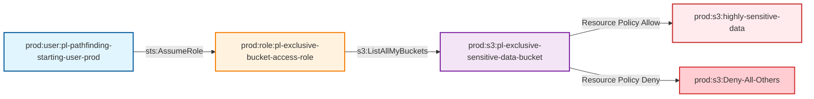

# Exclusive S3 Bucket Access Through Restrictive Resource Policy

* **Category:** Privilege Escalation
* **Sub-Category:** principal-access
* **Path Type:** multi-hop
* **Target:** to-bucket
* **Environments:** prod
* **Technique:** Access S3 bucket with exclusive resource policy that denies all except specific role

This module demonstrates how a role with minimal IAM permissions can access an S3 bucket through a restrictive resource-based policy that explicitly denies access to everyone else, creating an exclusive access scenario.

## Attack Path Overview

The attack path shows how a user can assume a role with only `s3:ListAllMyBuckets` permission and still access highly sensitive data in an S3 bucket through a restrictive resource-based policy that denies access to all other principals.

## Access Path Diagram



## Attack Steps

1. **Initial State**: User `pl-pathfinding-starting-user-prod` has permission to assume the `pl-exclusive-bucket-access-role`
2. **Role Assumption**: User assumes the role which only has `s3:ListAllMyBuckets` permission
3. **Bucket Discovery**: Role uses its limited permission to list all S3 buckets
4. **Restrictive Resource Policy Access**: The exclusive sensitive bucket has a resource policy that:
   - ALLOWS access only to the specific role
   - DENIES access to all other principals
5. **Exclusive Data Access**: Role can now read, write, and delete objects in the exclusive sensitive bucket
6. **Access Verification**: Demonstrates that other users are denied access

## Resources Created

### Prod Environment (`prod.tf`)
- **Exclusive Bucket Access Role** (`pl-exclusive-bucket-access-role`): Role that trusts the prod starting user
- **Minimal Policy**: Policy with only `s3:ListAllMyBuckets` permission
- **Exclusive Sensitive S3 Bucket**: Bucket with highly sensitive data and encryption
- **Restrictive Resource Policy**: Bucket policy that:
  - Allows access only to the specific role
  - Explicitly denies access to all other principals
- **Sample Data**: Highly sensitive files placed in the bucket for demonstration

## Prerequisites

- AWS CLI configured with appropriate credentials
- The prod starting user must have permission to assume the exclusive bucket access role
- The exclusive bucket access role must have `s3:ListAllMyBuckets` permission
- The exclusive sensitive bucket must have a restrictive resource policy

## Usage

### Deploy the Module

```bash
# From the project root
terraform init
terraform plan
terraform apply
```

### Run the Attack Demo

```bash
# Navigate to the module directory
cd modules/paths/prod_role_has_exclusive_access_to_bucket_through_resource_policy

# Make the demo script executable
chmod +x demo_attack.sh

# Run the attack demo
./demo_attack.sh
```

### Cleanup After Demo

```bash
# Make the cleanup script executable
chmod +x cleanup_attack.sh

# Run the cleanup script
./cleanup_attack.sh
```

## Demo Script Details

The `demo_attack.sh` script demonstrates the complete attack flow:

1. **Verification**: Checks current identity and permissions
2. **Role Assumption**: Assumes the exclusive bucket access role with minimal permissions
3. **Permission Testing**: Verifies that the role has limited IAM permissions
4. **Bucket Discovery**: Uses `s3:ListAllMyBuckets` to find the exclusive sensitive bucket
5. **Restrictive Resource Policy Access**: Accesses the bucket through the restrictive resource policy
6. **Data Exfiltration**: Reads and writes highly sensitive data
7. **Policy Verification**: Confirms the restrictive policy denies access to others
8. **Access Confirmation**: Verifies that IAM restrictions were bypassed

## Security Implications

This attack demonstrates a critical security vulnerability with additional complexity:

- **Resource Policy Bypass**: Resource policies can grant access even when IAM policies restrict it
- **Exclusive Access Model**: Demonstrates how restrictive policies can create exclusive access scenarios
- **Minimal Permission Escalation**: A role with very limited permissions can access highly sensitive data
- **Discovery Through Listing**: The ability to list buckets can lead to discovering sensitive resources
- **High Impact**: Full read/write access to highly sensitive S3 data with exclusive access
- **Policy Complexity**: Shows how complex resource policies can create security blind spots

## Mitigation Strategies

1. **Principle of Least Privilege**: Avoid granting `s3:ListAllMyBuckets` unless absolutely necessary
2. **Resource Policy Auditing**: Regularly audit S3 bucket resource policies for overly permissive rules
3. **Access Logging**: Enable S3 access logging to monitor bucket access patterns
4. **Bucket Naming**: Use non-descriptive bucket names to avoid easy discovery
5. **Conditional Policies**: Use more restrictive conditions in resource policies
6. **Regular Reviews**: Regularly review both IAM and resource policies for conflicts
7. **Monitoring**: Set up CloudTrail and CloudWatch alerts for suspicious S3 access
8. **Encryption**: Use additional encryption layers for highly sensitive data
9. **Policy Testing**: Regularly test access policies to ensure they work as intended
10. **Access Controls**: Implement additional access controls beyond just resource policies

## Testing

This module is included in the automated test suite. To run tests:

```bash
# From the project root
cd tests
./run_all_tests.sh
```

The test will verify that:
- The role assumption works correctly
- The role has limited IAM permissions
- The bucket can be discovered through listing
- The restrictive resource policy allows access to the authorized role
- The restrictive resource policy denies access to other principals
- Highly sensitive data can be read and written
- The exclusive access model works as intended

## Outputs

- `exclusive_bucket_access_role_name`: The name of the exclusive bucket access role
- `exclusive_bucket_access_role_arn`: The ARN of the exclusive bucket access role
- `exclusive_sensitive_bucket_name`: The name of the exclusive sensitive S3 bucket
- `exclusive_sensitive_bucket_arn`: The ARN of the exclusive sensitive S3 bucket
- `exclusive_sensitive_bucket_domain_name`: The domain name of the exclusive sensitive S3 bucket

## Variables

- `dev_account_id`: The AWS account ID for the dev environment
- `prod_account_id`: The AWS account ID for the prod environment
- `operations_account_id`: The AWS account ID for the operations environment
- `resource_suffix`: Random suffix for globally namespaced resources

## Technical Details

### Restrictive Resource Policy Example

The bucket resource policy allows only the specific role and denies everyone else:

```json
{
  "Version": "2012-10-17",
  "Statement": [
    {
      "Sid": "AllowExclusiveBucketAccessRole",
      "Effect": "Allow",
      "Principal": {
        "AWS": "arn:aws:iam::ACCOUNT:role/pl-exclusive-bucket-access-role"
      },
      "Action": [
        "s3:ListBucket",
        "s3:GetObject",
        "s3:PutObject",
        "s3:DeleteObject"
      ],
      "Resource": [
        "arn:aws:s3:::pl-exclusive-sensitive-data-bucket",
        "arn:aws:s3:::pl-exclusive-sensitive-data-bucket/*"
      ]
    },
    {
      "Sid": "DenyAllOtherAccess",
      "Effect": "Deny",
      "Principal": "*",
      "Action": [
        "s3:ListBucket",
        "s3:GetObject",
        "s3:PutObject",
        "s3:DeleteObject"
      ],
      "Resource": [
        "arn:aws:s3:::pl-exclusive-sensitive-data-bucket",
        "arn:aws:s3:::pl-exclusive-sensitive-data-bucket/*"
      ],
      "Condition": {
        "StringNotEquals": {
          "aws:PrincipalArn": "arn:aws:iam::ACCOUNT:role/pl-exclusive-bucket-access-role"
        }
      }
    }
  ]
}
```

### IAM Policy Example

The role's IAM policy is intentionally minimal:

```json
{
  "Version": "2012-10-17",
  "Statement": [
    {
      "Effect": "Allow",
      "Action": [
        "s3:ListAllMyBuckets"
      ],
      "Resource": "*"
    }
  ]
}
```

This demonstrates how restrictive resource policies can create exclusive access scenarios while still allowing IAM policy bypasses, creating a significant security risk when not properly managed.

## Comparison with Standard Resource Policy Module

This module differs from the standard resource policy module in several key ways:

1. **Explicit Deny**: The bucket policy explicitly denies access to all other principals
2. **Exclusive Access**: Only the specific role can access the bucket
3. **Higher Sensitivity**: Contains more sensitive sample data
4. **Policy Complexity**: More complex resource policy with both Allow and Deny statements
5. **Security Model**: Demonstrates a more restrictive security model that can still be bypassed

This makes it an excellent example of how even restrictive policies can be vulnerable to privilege escalation attacks.
