# S3 Bucket Access Through Resource Policy

* **Category:** Privilege Escalation
* **Sub-Category:** principal-access
* **Path Type:** multi-hop
* **Target:** to-bucket
* **Environments:** prod
* **Cost Estimate:** $0/mo
* **Technique:** Bypass S3 bucket resource policy restrictions by assuming role with bucket access
* **Terraform Variable:** `enable_tool_testing_resource_policy_bypass`
* **Schema Version:** 1.0.0
* **Attack Path:** starting_user → (AssumeRole) → role_a → (sts:AssumeRole) → bucket_role → bypass resource policy → bucket access
* **Attack Principals:** `arn:aws:iam::{account_id}:user/pl-pathfinding-starting-user-prod`; `arn:aws:iam::{account_id}:role/pl-prod-role-a`; `arn:aws:iam::{account_id}:role/pl-prod-bucket-role`; `arn:aws:s3:::pl-restricted-bucket-{account_id}`
* **Required Permissions:** `sts:AssumeRole` on `arn:aws:iam::*:role/pl-prod-bucket-role`
* **Helpful Permissions:** `iam:ListRoles` (Discover roles with bucket access); `s3:GetBucketPolicy` (View bucket resource policy restrictions); `iam:GetRole` (View role permissions)
* **MITRE Tactics:** TA0004 - Privilege Escalation, TA0005 - Defense Evasion, TA0009 - Collection
* **MITRE Techniques:** T1078.004 - Valid Accounts: Cloud Accounts, T1530 - Data from Cloud Storage Object

## Attack Overview

This module demonstrates how a role with minimal IAM permissions can access an S3 bucket through a resource-based policy, bypassing traditional IAM permission restrictions.

The attack path shows how a user can assume a role with only `s3:ListAllMyBuckets` permission and still access sensitive data in an S3 bucket through a resource-based policy. This is a critical security vulnerability: resource policies can grant access even when IAM identity policies would otherwise restrict it, and a role with very limited permissions can reach sensitive data if the bucket's resource policy is misconfigured.

This configuration appears in real environments when teams manage S3 access through bucket policies alone, without cross-referencing which IAM principals can assume roles that are explicitly permitted in those bucket policies.

### MITRE ATT&CK Mapping

- **Tactics**: TA0004 - Privilege Escalation, TA0005 - Defense Evasion, TA0009 - Collection
- **Techniques**: T1078.004 - Valid Accounts: Cloud Accounts, T1530 - Data from Cloud Storage Object

### Principals in the attack path

- `arn:aws:iam::{PROD_ACCOUNT}:user/pl-pathfinding-starting-user-prod` (starting user with assume-role permission)
- `arn:aws:iam::{PROD_ACCOUNT}:role/pl-prod-role-a` (intermediate role)
- `arn:aws:iam::{PROD_ACCOUNT}:role/pl-prod-bucket-role` (role with minimal IAM permissions, allowed by bucket resource policy)

### Attack Path Diagram

```mermaid
graph LR
    %% Nodes
    User[prod:user:pl-pathfinding-starting-user-prod]
    Role[prod:role:pl-bucket-access-role]
    Bucket[prod:s3:pl-sensitive-data-bucket]
    Data[prod:s3:confidential-data]

    %% Edges
    User -->|sts:AssumeRole| Role
    Role -->|s3:ListAllMyBuckets| Bucket
    Bucket -->|Resource Policy| Data

    %% Styling
    classDef startNode fill:#ff9999,stroke:#333,stroke-width:2px
    classDef roleNode fill:#ffcc99,stroke:#333,stroke-width:2px
    classDef targetNode fill:#99ff99,stroke:#333,stroke-width:2px

    class User startNode
    class Role roleNode
    class Bucket,Data targetNode
```



### Attack Steps

1. **Initial Access**: User `pl-pathfinding-starting-user-prod` has permission to assume the `pl-bucket-access-role`
2. **Role Assumption**: User assumes the role which only has `s3:ListAllMyBuckets` permission
3. **Bucket Discovery**: Role uses its limited permission to list all S3 buckets
4. **Resource Policy Access**: The sensitive bucket has a resource policy that allows the role to access it
5. **Data Exfiltration**: Role can now read, write, and delete objects in the sensitive bucket
6. **Verification**: Confirms that IAM identity policy restrictions were bypassed via the resource policy

### Scenario specific resources created

| ARN | Purpose |
|-----|---------|
| `arn:aws:iam::{PROD_ACCOUNT}:role/pl-bucket-access-role` | Role that trusts the prod starting user; has only `s3:ListAllMyBuckets` in its IAM policy |
| `arn:aws:s3:::pl-sensitive-data-bucket-{PROD_ACCOUNT}` | Sensitive S3 bucket with resource policy granting the bucket access role full object access |

## Attack Lab

### Prerequisites

1. Install the `plabs` CLI:
   ```bash
   brew install pathfinding-labs/tap/plabs
   ```
2. Configure your AWS profiles in `~/.plabs/plabs.yaml` (or run `plabs init` if you haven't already)

### Deploy with plabs non-interactive

```bash
plabs enable enable_tool_testing_resource_policy_bypass
plabs apply
```

### Deploy with plabs tui

1. Launch the TUI: `plabs`
2. Navigate to this scenario in the scenarios list
3. Press `space` to enable it
4. Press `d` to deploy

### Executing the automated demo_attack script

The script will:

1. **Verification**: Check current identity and permissions
2. **Role Assumption**: Assume the bucket access role with minimal permissions
3. **Permission Testing**: Verify that the role has limited IAM permissions
4. **Bucket Discovery**: Use `s3:ListAllMyBuckets` to find the sensitive bucket
5. **Resource Policy Access**: Access the bucket through the resource policy
6. **Data Exfiltration**: Read and write sensitive data
7. **Verification**: Confirm that IAM restrictions were bypassed

#### Resources created by attack script

- Temporary AWS session credentials for `pl-bucket-access-role`
- Sample data read/write operations on `pl-sensitive-data-bucket`

#### With plabs non-interactive

```bash
plabs demo --list
plabs demo resource-policy-bypass
```

#### With plabs tui

1. Launch the TUI: `plabs`
2. Navigate to this scenario in the scenarios list
3. Press `r` to run the demo script

### Cleanup

#### With plabs non-interactive

```bash
plabs cleanup --list
plabs cleanup resource-policy-bypass
```

#### With plabs tui

1. Launch the TUI: `plabs`
2. Navigate to this scenario in the scenarios list
3. Press `c` to run the cleanup script

### Teardown with plabs non-interactive

```bash
plabs disable enable_tool_testing_resource_policy_bypass
plabs apply
```

### Teardown with plabs tui

1. Launch the TUI: `plabs`
2. Navigate to this scenario in the scenarios list
3. Press `space` to disable it
4. Press `D` to destroy

## Detecting Misconfiguration (CSPM)

### What CSPM tools should detect

- S3 bucket resource policy grants access to an IAM role that has `s3:ListAllMyBuckets` on `*`, creating a path from that role to sensitive bucket data
- IAM role (`pl-bucket-access-role`) is assumable by a low-privilege starting user and is explicitly named in an S3 bucket resource policy granting broad object permissions (`s3:GetObject`, `s3:PutObject`, `s3:DeleteObject`)
- Resource policy on `pl-sensitive-data-bucket` permits full object access without requiring any corresponding IAM identity policy permission on the bucket, meaning any entity that can assume the role gains data access regardless of their IAM policies
- Discovery through `s3:ListAllMyBuckets` enables the role to enumerate bucket names, compounding the data exposure risk

### Prevention recommendations

1. **Principle of Least Privilege**: Avoid granting `s3:ListAllMyBuckets` unless absolutely necessary; scope bucket list permissions to specific buckets where possible
2. **Resource Policy Auditing**: Regularly audit S3 bucket resource policies to ensure that every principal explicitly named has a legitimate business need for that level of access
3. **Access Logging**: Enable S3 server access logging and CloudTrail data events on sensitive buckets to monitor for unexpected access patterns
4. **Conditional Policies**: Use `aws:PrincipalTag` or `aws:ResourceTag` conditions in resource policies to restrict access to tagged/approved principals rather than static ARNs
5. **Regular Cross-Reference Reviews**: Periodically cross-reference which IAM roles are named in bucket resource policies against which users or roles can assume those roles transitively
6. **Monitoring**: Set up CloudTrail and CloudWatch alerts for `s3:GetObject` and `s3:PutObject` events on sensitive buckets from roles with no direct IAM bucket permissions

## Detection Abuse (CloudSIEM)

### CloudTrail events to monitor

- `STS: AssumeRole` — Starting user assumes `pl-bucket-access-role`; watch for cross-role chains leading to S3 data events
- `S3: ListBucket` — Bucket enumeration using `s3:ListAllMyBuckets`; precursor to targeted data access
- `S3: GetObject` — Object read from the sensitive bucket; critical when the caller assumed a role with no direct IAM bucket permissions
- `S3: PutObject` — Object write to the sensitive bucket; high severity from a role with minimal IAM policy

### Detonation logs

_Detonation log integration (Stratus Red Team / Grimoire) is planned for a future release._

## Technical Details

### Resource Policy Example

The bucket resource policy allows the role to access the bucket:

```json
{
  "Version": "2012-10-17",
  "Statement": [
    {
      "Sid": "AllowBucketAccessRole",
      "Effect": "Allow",
      "Principal": {
        "AWS": "arn:aws:iam::ACCOUNT:role/pl-bucket-access-role"
      },
      "Action": [
        "s3:ListBucket",
        "s3:GetObject",
        "s3:PutObject",
        "s3:DeleteObject"
      ],
      "Resource": [
        "arn:aws:s3:::pl-sensitive-data-bucket",
        "arn:aws:s3:::pl-sensitive-data-bucket/*"
      ]
    }
  ]
}
```

### IAM Policy Example

The role's IAM policy is intentionally minimal:

```json
{
  "Version": "2012-10-17",
  "Statement": [
    {
      "Effect": "Allow",
      "Action": [
        "s3:ListAllMyBuckets"
      ],
      "Resource": "*"
    }
  ]
}
```

This demonstrates how resource policies can override IAM restrictions, creating a significant security risk when not properly managed.
