# S3 Bucket Access Through Resource Policy

* **Category:** Privilege Escalation
* **Sub-Category:** principal-access
* **Path Type:** multi-hop
* **Target:** to-bucket
* **Environments:** prod
* **Technique:** Bypass S3 bucket resource policy restrictions by assuming role with bucket access

This module demonstrates how a role with minimal IAM permissions can access an S3 bucket through a resource-based policy, bypassing traditional IAM permission restrictions.

## Attack Path Overview

The attack path shows how a user can assume a role with only `s3:ListAllMyBuckets` permission and still access sensitive data in an S3 bucket through a resource-based policy.

## Access Path Diagram

```mermaid
graph LR
    %% Nodes
    User[prod:user:pl-pathfinding-starting-user-prod]
    Role[prod:role:pl-bucket-access-role]
    Bucket[prod:s3:pl-sensitive-data-bucket]
    Data[prod:s3:confidential-data]
    
    %% Edges
    User -->|sts:AssumeRole| Role
    Role -->|s3:ListAllMyBuckets| Bucket
    Bucket -->|Resource Policy| Data
    
    %% Styling
    classDef userNode fill:#e1f5fe,stroke:#01579b,stroke-width:2px
    classDef roleNode fill:#fff3e0,stroke:#f57c00,stroke-width:2px
    classDef bucketNode fill:#f3e5f5,stroke:#7b1fa2,stroke-width:2px
    classDef dataNode fill:#ffebee,stroke:#c62828,stroke-width:2px
    
    class User userNode
    class Role roleNode
    class Bucket bucketNode
    class Data dataNode
```



## Attack Steps

1. **Initial State**: User `pl-pathfinding-starting-user-prod` has permission to assume the `pl-bucket-access-role`
2. **Role Assumption**: User assumes the role which only has `s3:ListAllMyBuckets` permission
3. **Bucket Discovery**: Role uses its limited permission to list all S3 buckets
4. **Resource Policy Access**: The sensitive bucket has a resource policy that allows the role to access it
5. **Data Exfiltration**: Role can now read, write, and delete objects in the sensitive bucket

## Resources Created

### Prod Environment (`prod.tf`)
- **Bucket Access Role** (`pl-bucket-access-role`): Role that trusts the prod starting user
- **Minimal Policy**: Policy with only `s3:ListAllMyBuckets` permission
- **Sensitive S3 Bucket**: Bucket with sensitive data and encryption
- **Resource Policy**: Bucket policy that allows the role to access the bucket
- **Sample Data**: Sensitive files placed in the bucket for demonstration

## Prerequisites

- AWS CLI configured with appropriate credentials
- The prod starting user must have permission to assume the bucket access role
- The bucket access role must have `s3:ListAllMyBuckets` permission
- The sensitive bucket must have a resource policy allowing the role access

## Usage

### Deploy the Module

```bash
# From the project root
terraform init
terraform plan
terraform apply
```

### Run the Attack Demo

```bash
# Navigate to the module directory
cd modules/paths/prod_role_has_access_to_bucket_through_resource_policy

# Make the demo script executable
chmod +x demo_attack.sh

# Run the attack demo
./demo_attack.sh
```

### Cleanup After Demo

```bash
# Make the cleanup script executable
chmod +x cleanup_attack.sh

# Run the cleanup script
./cleanup_attack.sh
```

## Demo Script Details

The `demo_attack.sh` script demonstrates the complete attack flow:

1. **Verification**: Checks current identity and permissions
2. **Role Assumption**: Assumes the bucket access role with minimal permissions
3. **Permission Testing**: Verifies that the role has limited IAM permissions
4. **Bucket Discovery**: Uses `s3:ListAllMyBuckets` to find the sensitive bucket
5. **Resource Policy Access**: Accesses the bucket through the resource policy
6. **Data Exfiltration**: Reads and writes sensitive data
7. **Verification**: Confirms that IAM restrictions were bypassed

## Security Implications

This attack demonstrates a critical security vulnerability:

- **Resource Policy Bypass**: Resource policies can grant access even when IAM policies restrict it
- **Minimal Permission Escalation**: A role with very limited permissions can access sensitive data
- **Discovery Through Listing**: The ability to list buckets can lead to discovering sensitive resources
- **High Impact**: Full read/write access to sensitive S3 data

## Mitigation Strategies

1. **Principle of Least Privilege**: Avoid granting `s3:ListAllMyBuckets` unless absolutely necessary
2. **Resource Policy Auditing**: Regularly audit S3 bucket resource policies
3. **Access Logging**: Enable S3 access logging to monitor bucket access
4. **Bucket Naming**: Use non-descriptive bucket names to avoid easy discovery
5. **Conditional Policies**: Use conditions in resource policies to restrict access
6. **Regular Reviews**: Regularly review both IAM and resource policies
7. **Monitoring**: Set up CloudTrail and CloudWatch alerts for suspicious S3 access
8. **Encryption**: Use additional encryption layers for sensitive data

## Testing

This module is included in the automated test suite. To run tests:

```bash
# From the project root
cd tests
./run_all_tests.sh
```

The test will verify that:
- The role assumption works correctly
- The role has limited IAM permissions
- The bucket can be discovered through listing
- The resource policy allows access to the bucket
- Sensitive data can be read and written

## Outputs

- `bucket_access_role_name`: The name of the bucket access role
- `bucket_access_role_arn`: The ARN of the bucket access role
- `sensitive_bucket_name`: The name of the sensitive S3 bucket
- `sensitive_bucket_arn`: The ARN of the sensitive S3 bucket
- `sensitive_bucket_domain_name`: The domain name of the sensitive S3 bucket

## Variables

- `dev_account_id`: The AWS account ID for the dev environment
- `prod_account_id`: The AWS account ID for the prod environment
- `operations_account_id`: The AWS account ID for the operations environment
- `resource_suffix`: Random suffix for globally namespaced resources

## Technical Details

### Resource Policy Example

The bucket resource policy allows the role to access the bucket:

```json
{
  "Version": "2012-10-17",
  "Statement": [
    {
      "Sid": "AllowBucketAccessRole",
      "Effect": "Allow",
      "Principal": {
        "AWS": "arn:aws:iam::ACCOUNT:role/pl-bucket-access-role"
      },
      "Action": [
        "s3:ListBucket",
        "s3:GetObject",
        "s3:PutObject",
        "s3:DeleteObject"
      ],
      "Resource": [
        "arn:aws:s3:::pl-sensitive-data-bucket",
        "arn:aws:s3:::pl-sensitive-data-bucket/*"
      ]
    }
  ]
}
```

### IAM Policy Example

The role's IAM policy is intentionally minimal:

```json
{
  "Version": "2012-10-17",
  "Statement": [
    {
      "Effect": "Allow",
      "Action": [
        "s3:ListAllMyBuckets"
      ],
      "Resource": "*"
    }
  ]
}
```

This demonstrates how resource policies can override IAM restrictions, creating a significant security risk when not properly managed.
