# Comprehensive Effective Permissions Evaluation Testing

**Category:** Tool Testing
**Sub-Category:** edge-case-detection
**Path Type:** one-hop
**Target:** to-bucket
**Environments:** prod
**Technique:** Testing security tool accuracy in evaluating effective permissions across 40 principals with admin patterns, denies, boundaries, multi-policy scenarios, and edge cases

## Overview

This scenario provides a comprehensive test suite for validating the accuracy of security tools, CSPM platforms, and IAM analyzers in evaluating effective permissions. Unlike traditional attack scenarios that demonstrate a single exploitation path, this scenario deploys 40 IAM principals (39 test principals + 1 starting user) with carefully crafted permission configurations designed to test the full spectrum of AWS IAM evaluation logic.

Security tools must correctly determine which principals have effective administrative access (`*` on `*` without IAM denies) by properly evaluating the complex interaction of identity-based policies, permissions boundaries, explicit denies, NotAction statements, multi-policy combinations, and group memberships. This scenario serves as a benchmark for measuring the accuracy and completeness of effective permissions evaluation engines.

Organizations deploying CSPM tools, IAM analyzers, or building custom security tooling can use this scenario to validate that their solutions correctly identify privilege escalation paths, properly handle deny statements, respect permissions boundaries, accurately aggregate multi-policy scenarios, and evaluate the full context of AWS IAM policy evaluation. False positives (flagging restricted principals as admin) and false negatives (missing actual admin access) both represent critical gaps in security posture visibility.

## Admin Definition

For this scenario, a principal is considered to have **admin access** if and only if:

> **You have `*` on `*` without any IAM denies (ignoring resource denies)**

This means:
- ✅ **Admin**: `Allow Action: *` + `Allow Resource: *` + No IAM deny statements
- ✅ **Admin**: Multiple policies that together provide `*` on `*` (e.g., `iam:*` + `NotAction iam:*`)
- ❌ **Not Admin**: Any explicit IAM deny statement that blocks actions (even if allows `*` on `*`)
- ❌ **Not Admin**: Permissions boundary that restricts the effective permission set
- ❌ **Not Admin**: Service-specific wildcards that don't collectively equal `*` (e.g., `s3:*` + `ec2:*` but missing other services)

**Important**: Resource-based denies (like S3 bucket policies) do NOT affect admin status in this scenario. We're testing IAM-level effective permissions evaluation only.

## Understanding the attack scenario

### Principal Organization

This scenario creates 40 principals organized into specific test categories:

#### Starting User (1 principal)
- `arn:aws:iam::PROD_ACCOUNT:user/pl-prod-epe-starting-user` (Can assume all test roles)

#### isAdmin Category (15 principals: 9 users + 6 roles)

**Single Policy (6 principals: 3 users + 3 roles)**
- `arn:aws:iam::PROD_ACCOUNT:user/pl-prod-epe-user-isAdmin-awsmanaged` (User with AWS managed AdministratorAccess)
- `arn:aws:iam::PROD_ACCOUNT:user/pl-prod-epe-user-isAdmin-customermanaged` (User with customer managed admin policy)
- `arn:aws:iam::PROD_ACCOUNT:user/pl-prod-epe-user-isAdmin-inline` (User with inline admin policy)
- `arn:aws:iam::PROD_ACCOUNT:role/pl-prod-epe-role-isAdmin-awsmanaged` (Role with AWS managed AdministratorAccess)
- `arn:aws:iam::PROD_ACCOUNT:role/pl-prod-epe-role-isAdmin-customermanaged` (Role with customer managed admin policy)
- `arn:aws:iam::PROD_ACCOUNT:role/pl-prod-epe-role-isAdmin-inline` (Role with inline admin policy)

**Group Membership (3 users only)**
- `arn:aws:iam::PROD_ACCOUNT:user/pl-prod-epe-user-isAdmin-via-group-awsmanaged` (User in group with AWS managed admin)
- `arn:aws:iam::PROD_ACCOUNT:user/pl-prod-epe-user-isAdmin-via-group-customermanaged` (User in group with customer managed admin)
- `arn:aws:iam::PROD_ACCOUNT:user/pl-prod-epe-user-isAdmin-via-group-inline` (User in group with inline admin)

**Multi-Policy (6 principals: 3 users + 3 roles)**
- `arn:aws:iam::PROD_ACCOUNT:user/pl-prod-epe-user-isAdmin-split-iam-and-notiam` (Two policies: `iam:*` + `NotAction iam:*` = `*`)
- `arn:aws:iam::PROD_ACCOUNT:user/pl-prod-epe-user-isAdmin-split-s3-and-nots3` (Two policies: `s3:*` + `NotAction s3:*` = `*`)
- `arn:aws:iam::PROD_ACCOUNT:user/pl-prod-epe-user-isAdmin-many-services-combined` (Many service wildcards that together = `*`)
- `arn:aws:iam::PROD_ACCOUNT:role/pl-prod-epe-role-isAdmin-split-iam-and-notiam` (Two policies: `iam:*` + `NotAction iam:*` = `*`)
- `arn:aws:iam::PROD_ACCOUNT:role/pl-prod-epe-role-isAdmin-split-s3-and-nots3` (Two policies: `s3:*` + `NotAction s3:*` = `*`)
- `arn:aws:iam::PROD_ACCOUNT:role/pl-prod-epe-role-isAdmin-many-services-combined` (Many service wildcards that together = `*`)

#### notAdmin Category (24 principals: 12 users + 12 roles)

**Single Deny (6 principals: 3 users + 3 roles)**
- `arn:aws:iam::PROD_ACCOUNT:user/pl-prod-epe-user-notAdmin-adminpolicy-plus-denyall` (AdministratorAccess + Deny `*` on `*`)
- `arn:aws:iam::PROD_ACCOUNT:user/pl-prod-epe-user-notAdmin-adminpolicy-plus-denynotaction` (AdministratorAccess + Deny `*` on `*` - equivalent to NotAction `[]`)
- `arn:aws:iam::PROD_ACCOUNT:user/pl-prod-epe-user-notAdmin-admin-plus-denynotaction-ec2only` (AdministratorAccess + Deny NotAction `[ec2:DescribeInstances]`)
- `arn:aws:iam::PROD_ACCOUNT:role/pl-prod-epe-role-notAdmin-adminpolicy-plus-denyall` (AdministratorAccess + Deny `*` on `*`)
- `arn:aws:iam::PROD_ACCOUNT:role/pl-prod-epe-role-notAdmin-adminpolicy-plus-denynotaction` (AdministratorAccess + Deny `*` on `*` - equivalent to NotAction `[]`)
- `arn:aws:iam::PROD_ACCOUNT:role/pl-prod-epe-role-notAdmin-adminpolicy-plus-denynotaction-ec2only` (AdministratorAccess + Deny NotAction `[ec2:DescribeInstances]`)

**Multi-Deny (6 principals: 3 users + 3 roles)**
- `arn:aws:iam::PROD_ACCOUNT:user/pl-prod-epe-user-notAdmin-adminpolicy-plus-deny-split-iam-notiam` (AdministratorAccess + Deny `iam:*` + Deny NotAction `iam:*`)
- `arn:aws:iam::PROD_ACCOUNT:user/pl-prod-epe-user-notAdmin-adminpolicy-plus-deny-incremental` (AdministratorAccess + many service denies = deny all)
- `arn:aws:iam::PROD_ACCOUNT:user/pl-prod-epe-user-notAdmin-split-allow-plus-denyall` (Split allows + Deny `*` on `*`)
- `arn:aws:iam::PROD_ACCOUNT:role/pl-prod-epe-role-notAdmin-adminpolicy-plus-deny-split-iam-notiam` (AdministratorAccess + Deny `iam:*` + Deny NotAction `iam:*`)
- `arn:aws:iam::PROD_ACCOUNT:role/pl-prod-epe-role-notAdmin-adminpolicy-plus-deny-incremental` (AdministratorAccess + many service denies = deny all)
- `arn:aws:iam::PROD_ACCOUNT:role/pl-prod-epe-role-notAdmin-split-allow-plus-denyall` (Split allows + Deny `*` on `*`)

**Single Boundary (6 principals: 3 users + 3 roles)**
- `arn:aws:iam::PROD_ACCOUNT:user/pl-prod-epe-user-notAdmin-admin-plus-boundary-allows-nothing` (AdministratorAccess + boundary with deny-all statement)
- `arn:aws:iam::PROD_ACCOUNT:user/pl-prod-epe-user-notAdmin-adminpolicy-plus-boundary-ec2only` (AdministratorAccess + boundary allowing only `ec2:DescribeInstances`)
- `arn:aws:iam::PROD_ACCOUNT:user/pl-prod-epe-user-notAdmin-admin-plus-boundary-na-ec2only` (AdministratorAccess + boundary NotAction `[ec2:DescribeInstances]`)
- `arn:aws:iam::PROD_ACCOUNT:role/pl-prod-epe-role-notAdmin-admin-plus-boundary-allows-nothing` (AdministratorAccess + boundary with deny-all statement)
- `arn:aws:iam::PROD_ACCOUNT:role/pl-prod-epe-role-notAdmin-adminpolicy-plus-boundary-ec2only` (AdministratorAccess + boundary allowing only `ec2:DescribeInstances`)
- `arn:aws:iam::PROD_ACCOUNT:role/pl-prod-epe-role-notAdmin-admin-plus-boundary-na-ec2only` (AdministratorAccess + boundary NotAction `[ec2:DescribeInstances]`)

**Multi-Policy with Boundary (6 principals: 3 users + 3 roles)**
- `arn:aws:iam::PROD_ACCOUNT:user/pl-prod-epe-user-notAdmin-split-allow-boundary-allows-nothing` (Split policies + deny-all boundary)
- `arn:aws:iam::PROD_ACCOUNT:user/pl-prod-epe-user-notAdmin-split-allow-boundary-ec2only` (Split policies + boundary allowing only EC2)
- `arn:aws:iam::PROD_ACCOUNT:user/pl-prod-epe-user-notAdmin-split-boundary-mismatch` (Policy allows S3/EC2, boundary allows IAM/Lambda = no overlap)
- `arn:aws:iam::PROD_ACCOUNT:role/pl-prod-epe-role-notAdmin-split-allow-boundary-allows-nothing` (Split policies + deny-all boundary)
- `arn:aws:iam::PROD_ACCOUNT:role/pl-prod-epe-role-notAdmin-split-allow-boundary-ec2only` (Split policies + boundary allowing only EC2)
- `arn:aws:iam::PROD_ACCOUNT:role/pl-prod-epe-role-notAdmin-split-boundary-mismatch` (Policy allows S3/EC2, boundary allows IAM/Lambda = no overlap)

#### Target Resource
- `arn:aws:s3:::pl-sensitive-data-epe-{account_id}-{suffix}` (Test S3 bucket for access validation)

### Attack Path Diagram

```mermaid
graph TB
    subgraph Starting["Starting Principal (1)"]
        START[pl-prod-epe-starting-user]
    end

    subgraph IsAdmin["isAdmin Principals (15)"]
        subgraph SinglePolicy["Single Policy (6)"]
            SP1[user-isAdmin-awsmanaged]
            SP2[user-isAdmin-customermanaged]
            SP3[user-isAdmin-inline]
            SP4[role-isAdmin-awsmanaged]
            SP5[role-isAdmin-customermanaged]
            SP6[role-isAdmin-inline]
        end

        subgraph GroupMembership["Group Membership (3)"]
            GM1[user-isAdmin-via-group-awsmanaged]
            GM2[user-isAdmin-via-group-customermanaged]
            GM3[user-isAdmin-via-group-inline]
        end

        subgraph MultiPolicy["Multi-Policy (6)"]
            MP1[user-isAdmin-split-iam-and-notiam]
            MP2[user-isAdmin-split-s3-and-nots3]
            MP3[user-isAdmin-many-services-combined]
            MP4[role-isAdmin-split-iam-and-notiam]
            MP5[role-isAdmin-split-s3-and-nots3]
            MP6[role-isAdmin-many-services-combined]
        end
    end

    subgraph NotAdmin["notAdmin Principals (24)"]
        subgraph SingleDeny["Single Deny (6)"]
            SD1[user-notAdmin-adminpolicy-plus-denyall]
            SD2[user-notAdmin-adminpolicy-plus-denynotaction]
            SD3[user-notAdmin-adminpolicy-plus-denynotaction-ec2only]
            SD4[role-notAdmin-adminpolicy-plus-denyall]
            SD5[role-notAdmin-adminpolicy-plus-denynotaction]
            SD6[role-notAdmin-adminpolicy-plus-denynotaction-ec2only]
        end

        subgraph MultiDeny["Multi-Deny (6)"]
            MD1[user-notAdmin-adminpolicy-plus-deny-split-iam-notiam]
            MD2[user-notAdmin-adminpolicy-plus-deny-incremental]
            MD3[user-notAdmin-split-allow-plus-denyall]
            MD4[role-notAdmin-adminpolicy-plus-deny-split-iam-notiam]
            MD5[role-notAdmin-adminpolicy-plus-deny-incremental]
            MD6[role-notAdmin-split-allow-plus-denyall]
        end

        subgraph SingleBoundary["Single Boundary (6)"]
            SB1[user-notAdmin-adminpolicy-plus-boundary-allows-nothing]
            SB2[user-notAdmin-adminpolicy-plus-boundary-ec2only]
            SB3[user-notAdmin-adminpolicy-plus-boundary-notaction-ec2only]
            SB4[role-notAdmin-adminpolicy-plus-boundary-allows-nothing]
            SB5[role-notAdmin-adminpolicy-plus-boundary-ec2only]
            SB6[role-notAdmin-adminpolicy-plus-boundary-notaction-ec2only]
        end

        subgraph MultiBoundary["Multi-Policy + Boundary (6)"]
            MB1[user-notAdmin-split-allow-boundary-allows-nothing]
            MB2[user-notAdmin-split-allow-boundary-ec2only]
            MB3[user-notAdmin-split-boundary-mismatch]
            MB4[role-notAdmin-split-allow-boundary-allows-nothing]
            MB5[role-notAdmin-split-allow-boundary-ec2only]
            MB6[role-notAdmin-split-boundary-mismatch]
        end
    end

    Target[S3 Bucket: pl-sensitive-data-epe]

    START -->|Can assume all roles| IsAdmin
    START -->|Can assume all roles| NotAdmin
    IsAdmin -->|EXPECT: ADMIN ACCESS| Target
    NotAdmin -->|EXPECT: BLOCKED| Target

    style Starting fill:#ccccff,stroke:#333,stroke-width:2px
    style IsAdmin fill:#99ff99,stroke:#333,stroke-width:2px
    style NotAdmin fill:#ff9999,stroke:#333,stroke-width:2px
    style Target fill:#9999ff,stroke:#333,stroke-width:3px
```



### Test Validation Matrix

Each principal tests specific aspects of effective permissions evaluation:

| Principal | Configuration | Expected Admin | Test Focus |
|-----------|--------------|----------------|------------|
| **isAdmin: Single Policy (6)** |
| user-isAdmin-awsmanaged | AWS managed AdministratorAccess | ✅ Admin | AWS managed policy detection |
| user-isAdmin-customermanaged | Customer managed admin policy | ✅ Admin | Customer managed policy detection |
| user-isAdmin-inline | Inline admin policy | ✅ Admin | Inline policy detection |
| role-isAdmin-awsmanaged | AWS managed AdministratorAccess | ✅ Admin | Role with AWS managed policy |
| role-isAdmin-customermanaged | Customer managed admin policy | ✅ Admin | Role with customer policy |
| role-isAdmin-inline | Inline admin policy | ✅ Admin | Role with inline policy |
| **isAdmin: Group Membership (3)** |
| user-isAdmin-via-group-awsmanaged | Group has AWS managed admin | ✅ Admin | Group inheritance (AWS managed) |
| user-isAdmin-via-group-customermanaged | Group has customer managed admin | ✅ Admin | Group inheritance (customer) |
| user-isAdmin-via-group-inline | Group has inline admin | ✅ Admin | Group inheritance (inline) |
| **isAdmin: Multi-Policy (6)** |
| user-isAdmin-split-iam-and-notiam | `iam:*` + `NotAction iam:*` = `*` | ✅ Admin | Split policy aggregation (IAM split) |
| user-isAdmin-split-s3-and-nots3 | `s3:*` + `NotAction s3:*` = `*` | ✅ Admin | Split policy aggregation (S3 split) |
| user-isAdmin-many-services-combined | Many service `*` = all `*` | ✅ Admin | Service wildcard aggregation |
| role-isAdmin-split-iam-and-notiam | `iam:*` + `NotAction iam:*` = `*` | ✅ Admin | Role split policy (IAM split) |
| role-isAdmin-split-s3-and-nots3 | `s3:*` + `NotAction s3:*` = `*` | ✅ Admin | Role split policy (S3 split) |
| role-isAdmin-many-services-combined | Many service `*` = all `*` | ✅ Admin | Role service aggregation |
| **notAdmin: Single Deny (6)** |
| user-notAdmin-adminpolicy-plus-denyall | Admin + Deny `*` on `*` | ❌ Not Admin | Explicit deny on everything |
| user-notAdmin-adminpolicy-plus-denynotaction | Admin + Deny `*` on `*` | ❌ Not Admin | Deny all actions (equivalent to NotAction `[]`) |
| user-notAdmin-admin-plus-denynotaction-ec2only | Admin + Deny NotAction `[ec2:DescribeInstances]` | ❌ Not Admin | Deny NotAction with exception |
| role-notAdmin-adminpolicy-plus-denyall | Admin + Deny `*` on `*` | ❌ Not Admin | Role deny everything |
| role-notAdmin-adminpolicy-plus-denynotaction | Admin + Deny `*` on `*` | ❌ Not Admin | Role deny all actions |
| role-notAdmin-adminpolicy-plus-denynotaction-ec2only | Admin + Deny NotAction `[ec2:DescribeInstances]` | ❌ Not Admin | Role deny NotAction with exception |
| **notAdmin: Multi-Deny (6)** |
| user-notAdmin-adminpolicy-plus-deny-split-iam-notiam | Admin + Deny `iam:*` + Deny NotAction `iam:*` | ❌ Not Admin | Split denies = deny all |
| user-notAdmin-adminpolicy-plus-deny-incremental | Admin + many service denies | ❌ Not Admin | Incremental denies = deny all |
| user-notAdmin-split-allow-plus-denyall | Split allow policies + Deny all | ❌ Not Admin | Multi-allow negated by deny |
| role-notAdmin-adminpolicy-plus-deny-split-iam-notiam | Admin + Deny `iam:*` + Deny NotAction `iam:*` | ❌ Not Admin | Role split denies |
| role-notAdmin-adminpolicy-plus-deny-incremental | Admin + many service denies | ❌ Not Admin | Role incremental denies |
| role-notAdmin-split-allow-plus-denyall | Split allow policies + Deny all | ❌ Not Admin | Role multi-allow + deny |
| **notAdmin: Single Boundary (6)** |
| user-notAdmin-admin-plus-boundary-allows-nothing | Admin + boundary (deny-all) | ❌ Not Admin | Boundary allows nothing |
| user-notAdmin-adminpolicy-plus-boundary-ec2only | Admin + boundary (`ec2:DescribeInstances`) | ❌ Not Admin | Boundary limits to single action |
| user-notAdmin-admin-plus-boundary-na-ec2only | Admin + boundary NotAction `[ec2:DescribeInstances]` | ❌ Not Admin | Boundary NotAction with exception |
| role-notAdmin-admin-plus-boundary-allows-nothing | Admin + boundary (deny-all) | ❌ Not Admin | Role boundary allows nothing |
| role-notAdmin-adminpolicy-plus-boundary-ec2only | Admin + boundary (`ec2:DescribeInstances`) | ❌ Not Admin | Role boundary single action |
| role-notAdmin-admin-plus-boundary-na-ec2only | Admin + boundary NotAction `[ec2:DescribeInstances]` | ❌ Not Admin | Role boundary NotAction |
| **notAdmin: Multi-Policy + Boundary (6)** |
| user-notAdmin-split-allow-boundary-allows-nothing | Split allow + boundary (deny-all) | ❌ Not Admin | Multi-policy negated by boundary |
| user-notAdmin-split-allow-boundary-ec2only | Split allow + boundary (EC2 only) | ❌ Not Admin | Boundary limits split policies |
| user-notAdmin-split-boundary-mismatch | Allow S3/EC2 + boundary IAM/Lambda | ❌ Not Admin | No intersection = no permissions |
| role-notAdmin-split-allow-boundary-allows-nothing | Split allow + boundary (deny-all) | ❌ Not Admin | Role multi-policy + boundary |
| role-notAdmin-split-allow-boundary-ec2only | Split allow + boundary (EC2 only) | ❌ Not Admin | Role boundary limits split |
| role-notAdmin-split-boundary-mismatch | Allow S3/EC2 + boundary IAM/Lambda | ❌ Not Admin | Role no intersection |

### Test Objectives

Security tools should correctly evaluate:

1. **Single Policy Admin Detection**: All 6 single-policy principals (AWS managed, customer managed, inline) should be detected as admin
2. **Group Membership Inheritance**: All 3 group-based users should be detected as admin through group membership
3. **Multi-Policy Aggregation**: All 6 multi-policy principals should be detected as admin when policies together equal `*` on `*`
4. **Split Policy Logic**: Tools must understand that `iam:*` + `NotAction iam:*` = `*` on `*`
5. **Service Wildcard Aggregation**: Tools must aggregate many service wildcards to determine if they collectively equal `*`
6. **Explicit Deny Precedence**: All 12 deny principals (single-deny + multi-deny) should be detected as NOT admin due to denies
7. **Explicit Deny Logic**: Tools must understand that explicit denies always override allows, even when denying all actions
8. **Split Deny Evaluation**: Tools must understand that `Deny iam:*` + `Deny NotAction iam:*` = deny everything
9. **Permissions Boundary Limits**: All 12 boundary principals (single-boundary + multi-policy-with-boundary) should be detected as NOT admin
10. **Boundary Intersection Logic**: Effective permissions = identity policies ∩ boundary (intersection, not union)
11. **Deny-Only Boundary Handling**: A boundary with only deny statements allows nothing
12. **Boundary Mismatch Detection**: When identity policies and boundaries have no overlapping permissions, effective permissions = nothing

### Scenario specific resources created

| Type | Name | Purpose |
|------|------|---------|
| **Starting Principal** |
| User | `pl-prod-epe-starting-user` | Can assume all test roles |
| **isAdmin Users (9)** |
| User | `pl-prod-epe-user-isAdmin-awsmanaged` | AWS managed AdministratorAccess |
| User | `pl-prod-epe-user-isAdmin-customermanaged` | Customer managed admin policy |
| User | `pl-prod-epe-user-isAdmin-inline` | Inline admin policy |
| User | `pl-prod-epe-user-isAdmin-via-group-awsmanaged` | Group with AWS managed admin |
| User | `pl-prod-epe-user-isAdmin-via-group-customermanaged` | Group with customer managed admin |
| User | `pl-prod-epe-user-isAdmin-via-group-inline` | Group with inline admin |
| User | `pl-prod-epe-user-isAdmin-split-iam-and-notiam` | Split policies: `iam:*` + `NotAction iam:*` |
| User | `pl-prod-epe-user-isAdmin-split-s3-and-nots3` | Split policies: `s3:*` + `NotAction s3:*` |
| User | `pl-prod-epe-user-isAdmin-many-services-combined` | Many service wildcards = `*` |
| **isAdmin Roles (6)** |
| Role | `pl-prod-epe-role-isAdmin-awsmanaged` | AWS managed AdministratorAccess |
| Role | `pl-prod-epe-role-isAdmin-customermanaged` | Customer managed admin policy |
| Role | `pl-prod-epe-role-isAdmin-inline` | Inline admin policy |
| Role | `pl-prod-epe-role-isAdmin-split-iam-and-notiam` | Split policies: `iam:*` + `NotAction iam:*` |
| Role | `pl-prod-epe-role-isAdmin-split-s3-and-nots3` | Split policies: `s3:*` + `NotAction s3:*` |
| Role | `pl-prod-epe-role-isAdmin-many-services-combined` | Many service wildcards = `*` |
| **notAdmin Users - Single Deny (3)** |
| User | `pl-prod-epe-user-notAdmin-adminpolicy-plus-denyall` | Admin + Deny `*` on `*` |
| User | `pl-prod-epe-user-notAdmin-adminpolicy-plus-denynotaction` | Admin + Deny `*` on `*` |
| User | `pl-prod-epe-user-notAdmin-admin-plus-denynotaction-ec2only` | Admin + Deny NotAction `[ec2:DescribeInstances]` |
| **notAdmin Roles - Single Deny (3)** |
| Role | `pl-prod-epe-role-notAdmin-adminpolicy-plus-denyall` | Admin + Deny `*` on `*` |
| Role | `pl-prod-epe-role-notAdmin-adminpolicy-plus-denynotaction` | Admin + Deny `*` on `*` |
| Role | `pl-prod-epe-role-notAdmin-adminpolicy-plus-denynotaction-ec2only` | Admin + Deny NotAction `[ec2:DescribeInstances]` |
| **notAdmin Users - Multi-Deny (3)** |
| User | `pl-prod-epe-user-notAdmin-adminpolicy-plus-deny-split-iam-notiam` | Admin + split denies |
| User | `pl-prod-epe-user-notAdmin-adminpolicy-plus-deny-incremental` | Admin + many service denies |
| User | `pl-prod-epe-user-notAdmin-split-allow-plus-denyall` | Split allows + Deny all |
| **notAdmin Roles - Multi-Deny (3)** |
| Role | `pl-prod-epe-role-notAdmin-adminpolicy-plus-deny-split-iam-notiam` | Admin + split denies |
| Role | `pl-prod-epe-role-notAdmin-adminpolicy-plus-deny-incremental` | Admin + many service denies |
| Role | `pl-prod-epe-role-notAdmin-split-allow-plus-denyall` | Split allows + Deny all |
| **notAdmin Users - Single Boundary (3)** |
| User | `pl-prod-epe-user-notAdmin-admin-plus-boundary-allows-nothing` | Admin + deny-all boundary |
| User | `pl-prod-epe-user-notAdmin-adminpolicy-plus-boundary-ec2only` | Admin + EC2-only boundary |
| User | `pl-prod-epe-user-notAdmin-admin-plus-boundary-na-ec2only` | Admin + boundary NotAction |
| **notAdmin Roles - Single Boundary (3)** |
| Role | `pl-prod-epe-role-notAdmin-admin-plus-boundary-allows-nothing` | Admin + deny-all boundary |
| Role | `pl-prod-epe-role-notAdmin-adminpolicy-plus-boundary-ec2only` | Admin + EC2-only boundary |
| Role | `pl-prod-epe-role-notAdmin-admin-plus-boundary-na-ec2only` | Admin + boundary NotAction |
| **notAdmin Users - Multi-Policy + Boundary (3)** |
| User | `pl-prod-epe-user-notAdmin-split-allow-boundary-allows-nothing` | Split allows + deny-all boundary |
| User | `pl-prod-epe-user-notAdmin-split-allow-boundary-ec2only` | Split allows + EC2 boundary |
| User | `pl-prod-epe-user-notAdmin-split-boundary-mismatch` | Policy-boundary no intersection |
| **notAdmin Roles - Multi-Policy + Boundary (3)** |
| Role | `pl-prod-epe-role-notAdmin-split-allow-boundary-allows-nothing` | Split allows + deny-all boundary |
| Role | `pl-prod-epe-role-notAdmin-split-allow-boundary-ec2only` | Split allows + EC2 boundary |
| Role | `pl-prod-epe-role-notAdmin-split-boundary-mismatch` | Policy-boundary no intersection |
| **Supporting Resources** |
| IAM Groups | `pl-prod-epe-group-awsmanaged`, `pl-prod-epe-group-customermanaged`, `pl-prod-epe-group-inline` | Groups for testing group membership |
| Customer Policies | `pl-prod-epe-admin-policy`, `pl-prod-epe-iam-only-policy`, `pl-prod-epe-notaction-iam-policy`, etc. | Reusable policies for testing |
| Boundary Policies | `pl-prod-epe-boundary-allows-nothing`, `pl-prod-epe-boundary-ec2only`, etc. | Permissions boundaries for testing |
| S3 Bucket | `pl-sensitive-data-epe-{account_id}-{suffix}` | Target resource for access testing |

## Executing the attack

### Using the automated demo_attack.sh

This scenario focuses on CSPM detection validation. The demo script tests all 39 principals (excluding starting user):

```bash
cd modules/scenarios/tool-testing/test-effective-permissions-evaluation
./demo_attack.sh
```

The script will:
1. Retrieve credentials for all principals from Terraform outputs
2. Test each principal's ability to access S3 (list bucket) and IAM (list users)
3. Determine effective admin status based on both S3 and IAM access
4. Compare actual results with expected results (admin vs not-admin)
5. Generate a comprehensive test report with pass/fail counts
6. Output summary statistics for isAdmin and notAdmin categories

**Expected Results:**
- **15 isAdmin principals**: Should have both S3 and IAM access (admin)
- **24 notAdmin principals**: Should have neither S3 nor IAM access (not-admin)
- **Total tests**: 39 principals tested

### Manual Testing with Security Tools

To validate your CSPM or IAM analyzer:

1. **Deploy the scenario**:
   ```bash
   terraform apply
   ```

2. **Run your security tool's scan**:
   - Point your CSPM/IAM analyzer at the prod account
   - Wait for discovery and analysis to complete
   - Export findings related to admin access and privilege escalation

3. **Compare results against expected outcomes**:
   - All 15 isAdmin principals should be flagged as having admin access
   - All 24 notAdmin principals should be flagged as restricted (no admin)
   - Pay special attention to multi-policy scenarios (split policies, many services)

4. **Calculate accuracy metrics**:
   - **True Positives (TP)**: isAdmin principals correctly identified as admin
   - **False Negatives (FN)**: isAdmin principals incorrectly identified as not-admin
   - **True Negatives (TN)**: notAdmin principals correctly identified as not-admin
   - **False Positives (FP)**: notAdmin principals incorrectly identified as admin
   - **Accuracy**: (TP + TN) / 39
   - **Precision**: TP / (TP + FP) — How many flagged as admin are actually admin?
   - **Recall**: TP / (TP + FN) — How many actual admins did we detect?

**Perfect Score:**
- TP = 15, FN = 0, TN = 24, FP = 0
- Accuracy = 100%, Precision = 100%, Recall = 100%

### Cleaning up the attack artifacts

This scenario creates no attack artifacts to clean up. All resources are managed by Terraform:

```bash
# To remove all test principals and resources
terraform destroy
```

## Detection and prevention

### What CSPM Tools Should Detect

A comprehensive CSPM or IAM analysis tool should correctly identify:

#### Must Detect as Admin (15 principals)

**Single Policy (6):**
- All principals with AdministratorAccess (AWS managed, customer managed, or inline)

**Group Membership (3):**
- All users whose groups have admin policies (AWS managed, customer managed, inline)

**Multi-Policy (6):**
- Principals with split policies that together equal `*` on `*`:
  - `iam:*` + `NotAction iam:*` = `*`
  - `s3:*` + `NotAction s3:*` = `*`
  - Many service wildcards that collectively cover all AWS services

#### Must Detect as Not Admin (24 principals)

**Single Deny (6):**
- Admin policy + Deny `*` on `*`
- Admin policy + Deny `*` on `*` (alternative implementation)
- Admin policy + Deny NotAction `[ec2:DescribeInstances]` (denies everything except one action)

**Multi-Deny (6):**
- Admin policy + Deny `iam:*` + Deny NotAction `iam:*` (split denies = deny all)
- Admin policy + many incremental service denies (together = deny all)
- Split allow policies + Deny `*` on `*`

**Single Boundary (6):**
- Admin policy + boundary with deny-all statement (allows nothing)
- Admin policy + boundary allowing only `ec2:DescribeInstances` (too restrictive)
- Admin policy + boundary NotAction `[ec2:DescribeInstances]` (allows only one action)

**Multi-Policy with Boundary (6):**
- Split allow policies + boundary allowing nothing (boundary blocks all)
- Split allow policies + EC2-only boundary (boundary too restrictive)
- Policy allows S3/EC2 + boundary allows IAM/Lambda (no intersection = no permissions)

### Critical Test Cases for Tool Validation

These scenarios are particularly important for distinguishing excellent tools from mediocre ones:

1. **Split Policy Aggregation**: Does your tool correctly aggregate `iam:*` + `NotAction iam:*` to recognize this equals full admin?

2. **Many Services Combined**: Does your tool aggregate multiple service wildcards (e.g., iam:*, s3:*, ec2:*, lambda:*, ...) to determine they collectively equal `*`?

3. **Explicit Deny All**: Does your tool correctly identify that `Deny * on *` blocks all access regardless of allow statements?

4. **Split Denies**: Does your tool recognize that `Deny iam:*` + `Deny NotAction iam:*` together deny everything?

5. **Boundary Intersection**: Does your tool correctly calculate effective permissions as the intersection of identity policies and boundaries?

6. **Deny-Only Boundary**: Does your tool recognize that a boundary with only deny statements allows nothing, regardless of identity policies?

7. **Boundary Mismatch**: Does your tool detect when identity policies and boundaries have zero overlap, resulting in no effective permissions?

8. **Group Inheritance**: Does your tool correctly evaluate permissions inherited through group memberships?

### Tool Testing Goals

This scenario helps answer critical questions about your security tooling:

1. **Policy Aggregation**: Does your tool correctly aggregate multiple policies from different sources?
2. **NotAction Logic**: Does your tool properly evaluate NotAction statements in both allows and denies?
3. **Deny Precedence**: Does your tool correctly apply deny-always-wins logic?
4. **Boundary Evaluation**: Does your tool understand permissions boundaries and calculate intersection correctly?
5. **Group Membership**: Does your tool follow group membership chains to evaluate inherited permissions?
6. **False Positive Rate**: How many notAdmin principals does your tool incorrectly flag as admin?
7. **False Negative Rate**: How many isAdmin principals does your tool miss?
8. **Edge Case Handling**: Does your tool handle empty boundaries, split policies, and mismatch scenarios?

### Expected Results Summary

| Category | Total | Expected Admin | Expected Not-Admin |
|----------|-------|----------------|-------------------|
| isAdmin: Single Policy | 6 | 6 | 0 |
| isAdmin: Group Membership | 3 | 3 | 0 |
| isAdmin: Multi-Policy | 6 | 6 | 0 |
| notAdmin: Single Deny | 6 | 0 | 6 |
| notAdmin: Multi-Deny | 6 | 0 | 6 |
| notAdmin: Single Boundary | 6 | 0 | 6 |
| notAdmin: Multi-Policy + Boundary | 6 | 0 | 6 |
| **Total (excluding starting user)** | **39** | **15** | **24** |

### MITRE ATT&CK Mapping

- **Tactic**: TA0009 - Collection, TA0004 - Privilege Escalation
- **Technique**: T1530 - Data from Cloud Storage Object, T1078.004 - Valid Accounts: Cloud Accounts

## Prevention recommendations

While this is a tool-testing scenario rather than a vulnerability demonstration, the configurations illustrate important security principles:

- **Principle of Least Privilege**: Grant only the minimum permissions necessary. Avoid broad administrative access unless absolutely required.

- **Avoid Complex Multi-Policy Scenarios**: While `iam:*` + `NotAction iam:*` technically equals `*`, this complexity makes security reviews difficult. Use explicit `*` on `*` if admin is needed.

- **Use Permissions Boundaries Carefully**: Boundaries are powerful but complex. Ensure clear documentation of intended intersection between identity policies and boundaries.

- **Explicit Denies for Guardrails**: Use deny statements to create hard boundaries, but avoid overly complex NotAction denies that are difficult to audit.

- **Group Membership Auditing**: Regularly audit group memberships, as users inherit all group permissions. A seemingly restricted user may have admin through group membership.

- **Test Before Deploying**: Use IAM Policy Simulator or Access Analyzer to validate complex policies before deployment. Ensure effective permissions match intent.

- **Document Admin Definitions**: Clearly define what "admin" means in your organization. Is it `*` on `*`? Is it specific privilege escalation paths? Document and test against this definition.

- **Regular Access Reviews**: Periodically review all principals with administrative access. Check identity policies, group memberships, boundaries, and denies.

- **Validate Your CSPM**: Use scenarios like this to validate your security tooling can accurately detect all admin access patterns, including complex multi-policy scenarios.

- **Monitor Policy Changes**: Use CloudTrail to monitor changes to IAM policies, group memberships, permissions boundaries, and role trust policies. Alert on unexpected modifications.

- **Use IAM Access Analyzer**: Leverage AWS IAM Access Analyzer to identify resources shared with external entities and validate IAM policies before deployment (Policy Validation feature).
