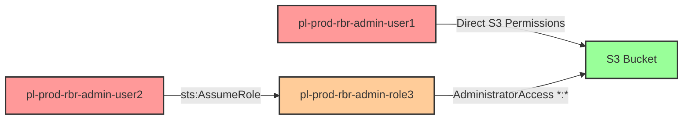

# Reverse Blast Radius: Direct and Indirect S3 Access Through Admin

* **Category:** Tool Testing
* **Sub-Category:** reverse-blast-radius
* **Path Type:** one-hop
* **Target:** to-bucket
* **Environments:** prod
* **Technique:** Validating security tool detection of both direct and indirect S3 bucket access via administrative permissions

## Overview

This tool testing scenario is designed to validate whether Cloud Security Posture Management (CSPM) tools and IAM analysis platforms can correctly answer the critical question: "Who has access to this S3 bucket?" The scenario creates two distinct access paths to the same sensitive S3 bucket - one through direct IAM permissions and another through administrative role assumption.

Many security tools excel at identifying direct permission grants but fail to recognize that principals with administrative access (such as the AWS-managed AdministratorAccess policy) implicitly have access to ALL resources in the account, including specific S3 buckets. This creates blind spots in reverse blast radius analysis, where security teams believe they have a complete picture of who can access sensitive data when in fact they're missing principals with indirect access through broad administrative permissions.

This scenario enables security teams to test their tooling's ability to perform comprehensive reverse blast radius analysis. Tools should identify both user1 (with explicit S3 permissions) and user2 (with access via an administrative role) when querying "who can access this bucket?" Failure to detect the administrative path represents a significant gap in security visibility that could lead to incomplete access reviews, flawed least-privilege implementations, and undetected privilege escalation paths.

## Understanding the attack scenario

### Principals in the attack path

- `arn:aws:iam::PROD_ACCOUNT:user/pl-prod-rbr-admin-user1` (User with direct S3 bucket access permissions)
- `arn:aws:iam::PROD_ACCOUNT:user/pl-prod-rbr-admin-user2` (User with permission to assume administrative role)
- `arn:aws:iam::PROD_ACCOUNT:role/pl-prod-rbr-admin-role3` (Administrative role with AdministratorAccess policy)
- `arn:aws:s3:::pl-sensitive-data-rbr-admin-PROD_ACCOUNT-SUFFIX` (Target S3 bucket with sensitive data)

### Attack Path Diagram



### Attack Steps

#### Path 1: Direct Access (user1)
1. **Initial Access**: Start as `pl-prod-rbr-admin-user1` (credentials provided via Terraform outputs)
2. **List Buckets**: Use `s3:ListAllMyBuckets` to discover the sensitive bucket
3. **Access Bucket**: Use `s3:ListBucket` and `s3:GetObject` to directly access bucket contents
4. **Verification**: Successfully read objects from the sensitive bucket

#### Path 2: Indirect Access via Admin Role (user2)
1. **Initial Access**: Start as `pl-prod-rbr-admin-user2` (credentials provided via Terraform outputs)
2. **Assume Role**: Use `sts:AssumeRole` to assume `pl-prod-rbr-admin-role3`
3. **Administrator Access**: Role has AdministratorAccess policy granting `*:*` permissions
4. **Access Bucket**: Use administrative permissions to access the same sensitive bucket
5. **Verification**: Successfully read objects from the sensitive bucket using admin credentials

### Scenario specific resources created

| ARN | Purpose |
| -- | -- |
| `arn:aws:iam::PROD_ACCOUNT:user/pl-prod-rbr-admin-user1` | User with direct S3 access permissions and access keys |
| `arn:aws:iam::PROD_ACCOUNT:user/pl-prod-rbr-admin-user2` | User with permission to assume administrative role and access keys |
| `arn:aws:iam::PROD_ACCOUNT:role/pl-prod-rbr-admin-role3` | Administrative role with AdministratorAccess managed policy |
| `arn:aws:iam::PROD_ACCOUNT:policy/pl-prod-rbr-admin-user1-s3-policy` | Policy granting direct S3 access to user1 |
| `arn:aws:iam::PROD_ACCOUNT:policy/pl-prod-rbr-admin-user2-assume-policy` | Policy granting user2 permission to assume role3 |
| `arn:aws:s3:::pl-sensitive-data-rbr-admin-PROD_ACCOUNT-SUFFIX` | Target S3 bucket containing sensitive data |

## Executing the attack

### Using the automated demo_attack.sh

To demonstrate both access paths to the S3 bucket, run the provided demo script:

```bash
cd modules/scenarios/tool-testing/test-reverse-blast-radius-direct-and-indirect-through-admin
./demo_attack.sh
```

The script will:
1. Display a step-by-step walkthrough with color-coded output
2. Demonstrate Path 1: Direct access using user1 credentials
3. Demonstrate Path 2: Indirect access via admin role using user2 credentials
4. Show the commands being executed and their results
5. Verify that both paths successfully access the same S3 bucket
6. Output standardized test results for automation

### Cleaning up the attack artifacts

This is a tool testing scenario focused on configuration analysis rather than runtime exploitation. The infrastructure remains in place for testing. If temporary credentials or objects were created during testing:

```bash
cd modules/scenarios/tool-testing/test-reverse-blast-radius-direct-and-indirect-through-admin
./cleanup_attack.sh
```

The cleanup script will remove any temporary test objects created in the S3 bucket during demonstrations, but preserves the core infrastructure for continued security tool testing.

## Detection and prevention

### What Security Tools Should Detect

When performing reverse blast radius analysis on the sensitive S3 bucket (`pl-sensitive-data-rbr-admin-*`), security tools should identify:

1. **Direct Access Path**:
   - `pl-prod-rbr-admin-user1` has explicit S3 permissions
   - Policy grants `s3:ListAllMyBuckets`, `s3:ListBucket`, and `s3:GetObject` on the bucket
   - This is typically what most tools successfully detect

2. **Indirect Access Path (Critical Test)**:
   - `pl-prod-rbr-admin-user2` has access via administrative role assumption
   - User2 can assume `pl-prod-rbr-admin-role3`
   - Role3 has AdministratorAccess policy (`*:*` on all resources)
   - Therefore, user2 has implicit access to the S3 bucket
   - **Many tools fail to detect this indirect administrative access path**

3. **Administrative Permission Analysis**:
   - Any principal with `*:*` permissions should be flagged as having access to ALL resources
   - Tools should recognize that AdministratorAccess grants S3 bucket access
   - This applies to both IAM roles and users with administrative policies

4. **Role Assumption Chain**:
   - Tools should traverse role assumption relationships
   - If UserA can assume RoleB, and RoleB has access to ResourceC, then UserA effectively has access to ResourceC

### Tool Validation Checklist

Use this scenario to test if your security tools can:
- [ ] Identify user1 as having direct access to the bucket
- [ ] Identify user2 as having indirect access via role assumption
- [ ] Recognize that AdministratorAccess policy grants access to all S3 buckets
- [ ] Traverse multi-step access paths (user → role → resource)
- [ ] Answer "who has access to this bucket?" with both direct and indirect principals
- [ ] Differentiate between explicit S3 permissions and implicit administrative access
- [ ] Report administrative privileges as a security risk for sensitive resource access

### MITRE ATT&CK Mapping

- **Tactic**: TA0009 - Collection, TA0004 - Privilege Escalation
- **Technique**: T1530 - Data from Cloud Storage Object
- **Sub-technique**: T1078.004 - Valid Accounts: Cloud Accounts

## Prevention recommendations

While this is a tool testing scenario, the patterns it demonstrates highlight important security practices:

- Minimize the use of AdministratorAccess and other highly privileged managed policies - they create implicit access to all resources that's difficult to track
- Implement principle of least privilege with specific, scoped permissions rather than broad administrative access
- Use IAM Access Analyzer to identify all principals with access to sensitive S3 buckets, including those with administrative permissions
- Regularly audit role assumption permissions and trust relationships to understand privilege escalation paths
- Implement resource-based policies on S3 buckets to add additional access controls beyond IAM policies
- Use AWS Organizations SCPs to prevent creation of overly permissive administrative policies at scale
- Enable CloudTrail logging and monitor for role assumption events (`AssumeRole`) to high-privilege roles
- Tag sensitive S3 buckets and implement automated scanning to identify all principals with access (direct or indirect)
- Consider using AWS IAM Access Analyzer's policy validation to assess permissions before deployment
- Implement break-glass procedures for administrative access that require additional authentication and are time-limited
- Use session policies when assuming administrative roles to scope down permissions to only what's needed for the task

## Tool Testing Goals

This scenario serves as a benchmark for evaluating CSPM and IAM analysis tools. A comprehensive security tool should:

1. **Reverse Blast Radius Analysis**: Given a resource (S3 bucket), identify ALL principals with access
2. **Administrative Permission Detection**: Recognize that `*:*` permissions grant access to specific resources
3. **Multi-Hop Traversal**: Follow role assumption chains to identify indirect access paths
4. **Policy Interpretation**: Correctly parse and evaluate AWS managed policies like AdministratorAccess
5. **Complete Access Mapping**: Provide security teams with a full picture of who can access sensitive data

If your security tooling identifies only user1 (direct access) but misses user2 (administrative access), you have a significant gap in your security visibility that could impact incident response, access reviews, and compliance reporting.
