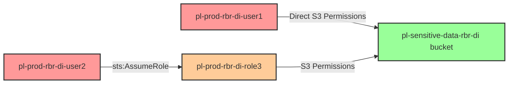

# Tool Testing: Reverse Blast Radius Query Detection (Direct and Indirect S3 Access)

* **Category:** Tool Testing
* **Sub-Category:** reverse-blast-radius
* **Path Type:** one-hop
* **Target:** to-bucket
* **Environments:** prod
* **Technique:** Testing security tool capability to identify both direct and indirect S3 bucket access paths in reverse blast radius queries

## Overview

This scenario is specifically designed to validate that Cloud Security Posture Management (CSPM) tools and security analysis platforms can accurately answer the critical question: "Who has access to this S3 bucket?" Modern security tools must identify not only direct IAM permissions that grant bucket access, but also indirect access paths through role assumption chains.

The scenario creates two distinct access paths to the same sensitive S3 bucket. The first path provides direct IAM permissions to a user, granting immediate access to the bucket. The second path involves an intermediate role assumption - a user can assume a role, and that role has the same S3 bucket permissions. Both users should appear in any "reverse blast radius" query asking "who can access this bucket?"

This test is essential for validating security tool accuracy because many tools fail to traverse the complete graph of IAM relationships. A tool that only reports direct permissions would miss half the risk surface, failing to identify users who can reach the bucket through role assumption. Organizations rely on these queries to understand their true attack surface, make access decisions, and respond to incidents. This scenario provides a definitive test case: if a security tool cannot identify both users as having bucket access, it has incomplete visibility into the environment's IAM topology.

## Understanding the attack scenario

### Principals in the attack path

- `arn:aws:iam::PROD_ACCOUNT:user/pl-prod-rbr-di-user1` (User with direct S3 bucket access)
- `arn:aws:iam::PROD_ACCOUNT:user/pl-prod-rbr-di-user2` (User who can assume role with S3 access)
- `arn:aws:iam::PROD_ACCOUNT:role/pl-prod-rbr-di-role3` (Role with S3 bucket access, assumable by user2)
- `arn:aws:s3:::pl-sensitive-data-rbr-di-{account-id}-{suffix}` (Target sensitive S3 bucket)

### Attack Path Diagram



### Attack Steps

1. **Path 1 - Direct Access**: User `pl-prod-rbr-di-user1` has direct IAM permissions to list and read objects from the sensitive S3 bucket
2. **Path 2 - Indirect Access (Step 1)**: User `pl-prod-rbr-di-user2` can assume role `pl-prod-rbr-di-role3`
3. **Path 2 - Indirect Access (Step 2)**: Role `pl-prod-rbr-di-role3` has the same S3 bucket permissions as user1
4. **Verification**: Both users can successfully access the S3 bucket (user1 directly, user2 via assumed role)

### Scenario specific resources created

| ARN | Purpose |
| -- | -- |
| `arn:aws:iam::PROD_ACCOUNT:user/pl-prod-rbr-di-user1` | User with direct S3 bucket access permissions (access keys provided) |
| `arn:aws:iam::PROD_ACCOUNT:user/pl-prod-rbr-di-user2` | User with sts:AssumeRole permission for role3 (access keys provided) |
| `arn:aws:iam::PROD_ACCOUNT:role/pl-prod-rbr-di-role3` | Role with S3 bucket access, assumable by user2 |
| `arn:aws:s3:::pl-sensitive-data-rbr-di-{account-id}-{suffix}` | Target sensitive S3 bucket containing test data |

## Executing the attack

### Using the automated demo_attack.sh

To demonstrate both access paths to the S3 bucket, run the provided demo script:

```bash
cd modules/scenarios/tool-testing/test-reverse-blast-radius-direct-and-indirect-to-bucket
./demo_attack.sh
```

The script will:
1. Display a step-by-step walkthrough with color-coded output
2. Show the commands being executed and their results
3. Verify successful bucket access via both paths (direct and indirect)
4. Output standardized test results for automation

### Cleaning up the attack artifacts

This scenario creates no attack artifacts during the demonstration. The demo script only performs read operations (listing buckets, getting objects) and does not create or modify any resources. Therefore, no cleanup script is needed.

## Detection and prevention

### What Security Tools Should Detect

A properly configured security analysis platform or CSPM tool performing a reverse blast radius query on the S3 bucket should identify:

1. **Direct Access Path**: `pl-prod-rbr-di-user1` has direct access to the bucket through IAM permissions
2. **Indirect Access Path**: `pl-prod-rbr-di-user2` has indirect access to the bucket through role assumption (`user2` → `role3` → `bucket`)
3. **Complete Access List**: When asked "Who has access to bucket pl-sensitive-data-rbr-di-*?", the tool should return BOTH users in the result set

**Expected Query Results:**

Query: "Who can access bucket `pl-sensitive-data-rbr-di-{account-id}-{suffix}`?"

Expected Response:
```
- arn:aws:iam::{account-id}:user/pl-prod-rbr-di-user1 (direct access)
- arn:aws:iam::{account-id}:user/pl-prod-rbr-di-user2 (indirect via role/pl-prod-rbr-di-role3)
- arn:aws:iam::{account-id}:role/pl-prod-rbr-di-role3 (direct access)
```

### MITRE ATT&CK Mapping

- **Tactic**: TA0009 - Collection
- **Technique**: T1530 - Data from Cloud Storage Object

### Tool Testing Focus

This scenario specifically tests:

1. **Graph Traversal Capability**: Can the tool traverse IAM trust relationships to identify indirect access?
2. **Complete Path Enumeration**: Does the tool identify ALL principals with access, not just those with direct permissions?
3. **Role Assumption Detection**: Can the tool recognize that users who can assume roles inherit those roles' permissions?
4. **Reverse Query Accuracy**: When querying "who has access to X", does the tool return complete results?

### Expected Tool Behavior

**Passing Tools:**
- Identify both user1 (direct) and user2 (indirect) as having bucket access
- Show the complete path: user2 → role3 → bucket
- Provide clear indication of direct vs. indirect access
- Include role3 itself as a principal with access

**Failing Tools:**
- Only identify user1 (direct access)
- Only identify role3 but miss user2
- Fail to traverse the AssumeRole trust relationship
- Provide incomplete results for "who has access" queries

## Prevention recommendations

While this is a tool-testing scenario designed to validate detection capabilities rather than demonstrate a real vulnerability, the following best practices apply to managing S3 bucket access in production environments:

- Use AWS IAM Access Analyzer to continuously monitor and validate S3 bucket access permissions
- Implement least privilege principles - grant S3 access only to principals that require it
- Regularly audit IAM trust relationships to understand complete access paths to sensitive resources
- Use S3 bucket policies in addition to IAM policies to implement defense in depth
- Monitor CloudTrail for S3 access patterns from unexpected principals or roles
- Implement SCPs (Service Control Policies) at the organization level to prevent overly broad S3 permissions
- Use tools that support reverse blast radius queries to understand "who can access X" for critical resources
- Regularly validate that your security tooling can identify both direct and indirect access paths
- Consider implementing resource-based conditions that restrict access even when IAM permissions allow it
- Use AWS Config rules to detect and alert on changes to S3 bucket permissions or IAM trust policies
